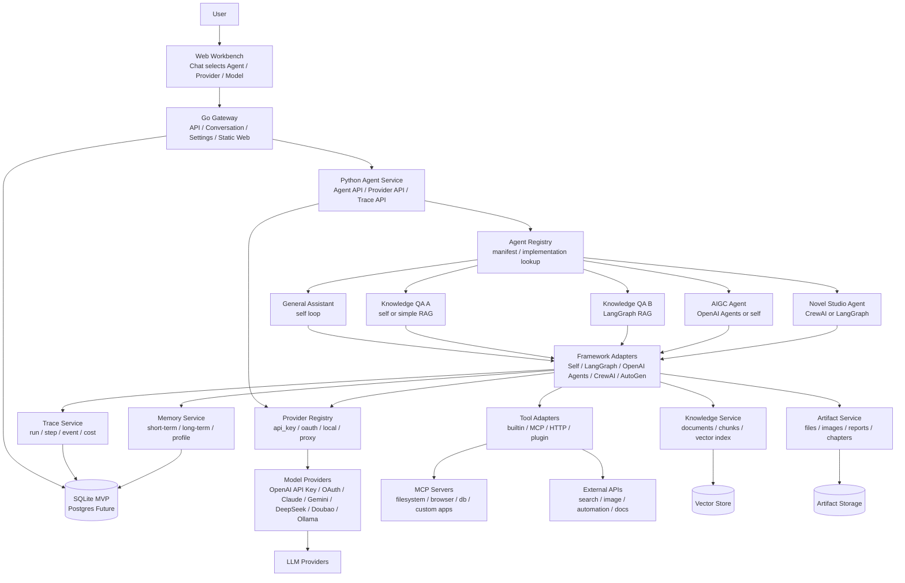
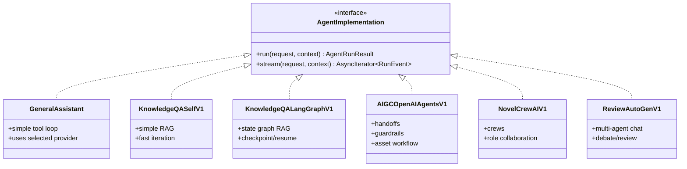
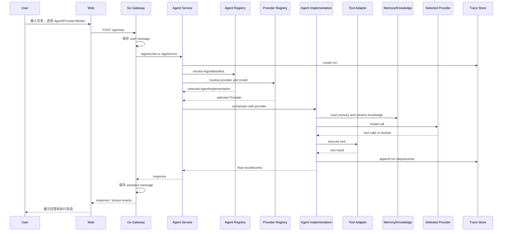
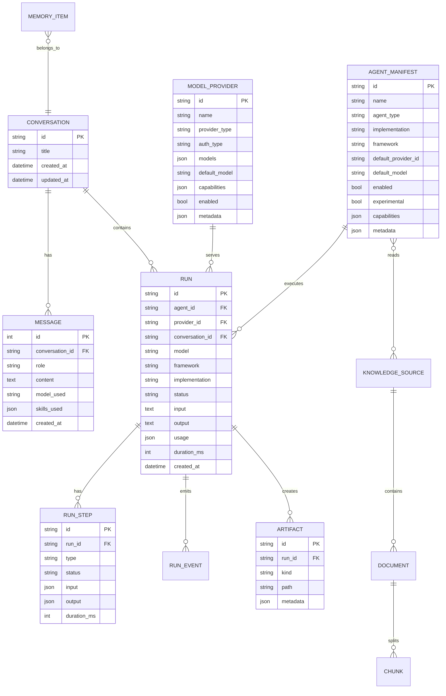
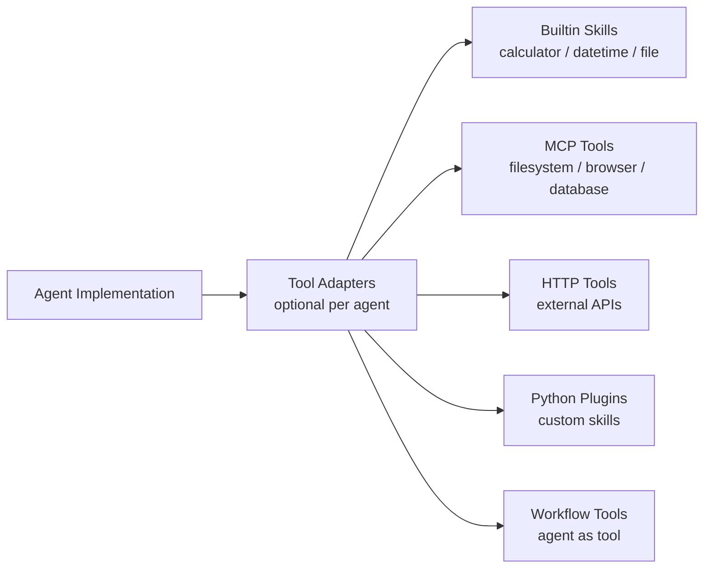
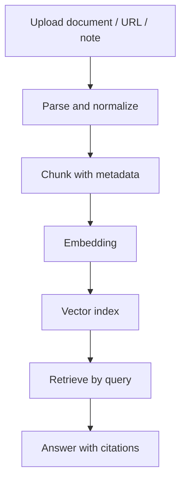

# Personal AI Workbench 架构与设计方案

版本：Draft v0.3  
目标：日常可用 + 面试 showcase + 多 Agent 框架实验平台

开发、启动、测试和运行限制见：[Agent Assistant 开发与运行规范](./development-and-operations.md)。

## 1. 产品定位

这个项目不只做一个聊天机器人，而是做一个个人 AI 工作台：

- 对日常使用：提供通用助手、知识问答、内容创作、长任务执行、文件/工具处理。
- 对面试展示：展示 AI 应用工程能力，包括 Agent 抽象、工具协议、RAG、可观测性、插件化、多框架实现对比。
- 对后续扩展：允许保留专业场景 Agent，例如专业智能问答、AIGC、小说生成、研究报告、代码助手。
- 对主入口体验：Chat 升级为 Super Chat，后续做意图识别、调用对应 Agent、汇总总结回答。

核心定位：

```text
一个自研平台壳 + 会话选择 Agent/Provider/Model + 专业 Agent 独立实现 + Go/Python 分离部署
```

## 2. 设计原则

1. 主入口只暴露 Agent、Provider、Model  
   用户在同一个会话里应该能切换不同 provider 和 model，例如 Doubao、Gemini、DeepSeek、OpenAI API Key、OAuth Provider。本质上 provider 解决“模型能力从哪里来、怎么鉴权”，不应该和 Agent 框架混在一起。

2. Agent 框架收敛到具体 Agent 实现  
   LangGraph、OpenAI Agents、CrewAI、AutoGen、自研 loop 都是某个 Agent 的内部实现细节，不作为普通会话主入口。需要研究框架差异时，可以做成 `智能问答 A 版`、`智能问答 B 版`、`小说生成 CrewAI 版` 这类 Agent 变体。

3. Go Gateway 与 Python Agent Service 分离  
   Go 负责产品后端、会话、配置、静态资源和后续鉴权/限流；Python 负责 Agent 实现、模型调用、工具执行、记忆、知识检索和 trace。

4. 可观测性内建  
   每次 Agent 运行都要有 run、step、event、tool call、token、耗时、错误，方便调试和面试讲解。

5. Memory 自研，工具和框架按 Agent 需要适配  
   Conversation memory、long-term memory、knowledge memory 应由平台自己沉淀；工具定义不强制统一成一个厚 `ToolSpec`，但需要能被 trace、权限和 UI 调试层理解。

6. 专业 Agent 可 A/B 对比  
   同一专业场景可以同时保留多个实现版本，例如 `knowledge_qa_self_v1`、`knowledge_qa_langgraph_v1`、`knowledge_qa_openai_agents_v1`。平台负责统一入口、trace 和评估，不强行要求内部实现一致。

## 3. 总体架构



当前仓库可以自然演进：

- `gateway/`：继续作为 Go API Gateway，负责会话、配置、静态页面、数据库读写。
- `agent/`：继续作为 Python Agent Service，负责 Agent 实现、provider 适配、工具、Memory、Trace。
- `web/`：从聊天页升级为工作台，增加 Agents、Tools、Knowledge、Runs 等视图。
- `config/`：从模型配置扩展到 Agent 模板、provider 配置、工具配置。

## 4. 核心模块

### 4.1 Web Workbench

建议导航结构：

```text
Super Chat 通用入口：意图识别、Agent 调用、汇总回答
Agents     Agent 模板、实现版本和实验变体
Tools      工具、MCP、插件管理
Knowledge  文档、知识库、索引管理
Runs       执行轨迹、调试、成本分析
Settings   模型、密钥、系统配置
```

关键体验：

- Chat 主入口选择 `Agent + Provider + Model`，同一个会话可以按轮次切换 provider。
- Agent 框架不作为主入口选项，只在 Agent 高级配置或实验说明里展示。
- Agent 卡片点击后进入具体功能，并创建一个新的 task/conversation。
- 常用 Agent 可以固定到左侧栏，作为个人工作台快捷入口。
- 专业 Agent 支持多版本并存，例如 `智能问答 A 版`、`智能问答 B 版`，用于效果、成本、耗时和可维护性对比。
- 对每次执行展示 timeline：模型思考、工具调用、检索、handoff、人工确认、最终输出。
- 专业 Agent 可以有专属工作区，例如小说 Agent 的人物卡/章节面板，AIGC Agent 的素材/产物面板。

### 4.2 Go Gateway

职责：

- Web 静态资源服务。
- Conversation / Message CRUD。
- Agent / Tool / Knowledge / Run API 聚合。
- 用户设置、模型配置、运行偏好。
- 后续可扩展本地用户认证、限流、审计。

建议 API：

```text
POST   /api/chat
GET    /api/conversations
POST   /api/conversations
GET    /api/agents
POST   /api/agents
GET    /api/providers
POST   /api/providers
POST   /api/providers/test
GET    /api/tools
POST   /api/tools/test
GET    /api/knowledge
POST   /api/knowledge/documents
GET    /api/runs
GET    /api/runs/:id
GET    /api/artifacts/:id
```

### 4.3 Python Agent Service

职责：

- Agent registry：列出可用 Agent、实验 Agent、实现版本、依赖状态。
- Provider registry：管理 API key、OAuth、本地模型、代理模型等 provider。
- 薄 Agent implementation 接口：只约束输入、输出、trace，不强制框架内部怎么组织 memory/tool/state。
- LLM provider 适配：OpenAI API Key、OAuth Provider、Claude、Gemini、DeepSeek、Doubao、Ollama。
- 默认 self loop 通用助手。
- LangGraph Knowledge/Research Agent 作为第一个框架型 Agent 变体。
- Memory / Knowledge / Artifact / Trace 管理。
- Streaming event 输出。

建议内部结构：

```text
agent/
  agents/
    general_assistant.py
    knowledge_qa_self_v1.py
    knowledge_qa_langgraph_v1.py
    research_langgraph_v1.py
  frameworks/
    registry.py
    self_loop.py
    langgraph_adapter.py
    openai_agents_adapter.py
    crewai_adapter.py
    autogen_adapter.py
  providers/
    registry.py
    openai_api_key.py
    oauth_provider.py
    codex_oauth.py
    doubao.py
    gemini.py
    deepseek.py
  schemas/
    agent.py
    provider.py
    chat.py
    trace.py
  skills/
    registry.py
    builtin/
  trace/
    store.py
    events.py
  knowledge/
    ingestion.py
    retrieval.py
  artifacts/
    store.py
```

## 5. 平台薄协议

### 5.1 AgentManifest

`AgentManifest` 用于列表、选择、展示和版本管理，不试图表达所有框架内部能力。框架字段是实现说明，不是普通聊天入口。

```python
class AgentManifest(BaseModel):
    id: str
    name: str
    description: str
    agent_type: str  # general | knowledge_qa | aigc | novel | research
    implementation: str  # self_v1 | langgraph_v1 | crewai_v1
    framework: str  # self | langgraph | openai_agents | crewai | autogen
    default_provider_id: str | None = None
    default_model: str | None = None
    enabled: bool
    experimental: bool = False
    capabilities: list[str] = []
    metadata: dict = {}
```

### 5.2 ModelProviderSpec

Provider 负责模型能力和鉴权方式。OAuth 应该放在 provider 层，而不是 Agent 框架层。

```python
class ModelProviderSpec(BaseModel):
    id: str
    name: str
    provider_type: str  # openai | claude | gemini | doubao | deepseek | ollama | codex
    auth_type: str  # api_key | oauth | local | proxy | none
    models: list[str] = []
    default_model: str | None = None
    capabilities: dict = {}
    enabled: bool = True
    metadata: dict = {}
```

Provider 示例：

```text
openai_api_key       auth_type=api_key
openai_oauth         auth_type=oauth, reserved for official/general API OAuth if available
codex_oauth          auth_type=oauth, calls Codex local workflows, not raw OpenAI API
doubao_api_key       auth_type=api_key
gemini_api_key       auth_type=api_key
ollama_local         auth_type=local
```

### 5.3 ChatRequest

会话请求明确携带 `agent_id`、`provider_id`、`model`。这样同一个会话可以使用不同 provider，而 Agent 实现保持不变。

```python
class ChatRequest(BaseModel):
    conversation_id: str
    message: str
    agent_id: str | None = None
    provider_id: str | None = None
    model: str | None = None
    stream: bool = False
```

### 5.4 AgentImplementation

Agent implementation 是真正的底层契约。它不要求具体 Agent 暴露同一种 memory 或 tool schema，只要求能接收请求、使用选定 provider、写 trace、返回结果。

```python
class AgentImplementation(Protocol):
    async def run(
        self,
        request: AgentRequest,
        context: AgentContext,
    ) -> AgentRunResult:
        ...

    async def stream(
        self,
        request: AgentRequest,
        context: AgentContext,
    ) -> AsyncIterator[RunEvent]:
        ...
```

### 5.5 Tool 与 Memory 的边界

- Memory 是平台长期资产：conversation memory、profile memory、knowledge memory 要自研和可迁移。
- Tool 可以有多个来源：built-in skill、HTTP、MCP、框架原生 tool。平台只要求工具调用能写入 trace 和接受权限管控。
- 如果某个 Agent 需要 `ToolSpec`，可以在该 Agent 内部定义，不作为所有 Agent 的强制公共协议。

### 5.6 RunEvent

Agent implementation 不直接操作前端 UI，而是不断发出标准事件。

```python
class RunEvent(BaseModel):
    run_id: str
    step_id: str | None = None
    type: str
    status: str
    payload: dict = {}
    created_at: datetime
```

常见事件类型：

```text
run.started
model.started
model.completed
tool.started
tool.completed
retrieval.started
retrieval.completed
handoff.started
handoff.completed
approval.required
artifact.created
run.completed
run.failed
```

## 6. Agent 实现与框架适配



框架选择不作为主入口，而是 Agent 实现策略：

| 框架/实现 | 适合场景 | 优先级 | 说明 |
| --- | --- | --- | --- |
| Self loop | 通用助手、简单工具调用、智能问答 A 版 | P0 | 基于现有 `AgentEngine` 演进 |
| LangGraph | 智能问答 B 版、研究报告、长任务 | P1 | 很适合展示状态图、checkpoint、可恢复流程 |
| OpenAI Agents | AIGC、handoff、guardrails、MCP 实验 | P1 | 适合展示最新 Agent SDK 思路 |
| CrewAI | 小说生成、多角色内容生产 | P2 | 展示专业 Agent 团队 |
| AutoGen | 多 Agent 对话实验、方案评审、辩论 | P3 | 可作为实验区 |

示例 Agent 变体：

```text
general_assistant_self_v1
knowledge_qa_self_v1          智能问答 A 版
knowledge_qa_langgraph_v1     智能问答 B 版
research_langgraph_v1
aigc_openai_agents_v1
novel_crewai_v1
review_autogen_v1
```

## 7. 请求执行流程



## 8. 数据模型草案



MVP 可以继续用 SQLite，后续再切 Postgres。RunTrace 和 Knowledge 如果增长很快，可以独立表或独立存储。

## 9. 工具系统设计

工具不强制统一成一个厚 registry，但平台需要能观察工具调用：



工具执行策略：

- 能提供 JSON Schema 的工具尽量提供，便于 LLM function calling 和 UI 展示。
- 工具结果统一包装为 `ToolResult`。
- 高风险工具需要 `requires_approval`。
- 工具调用必须写入 `RunEvent` 或 `RunStep`。
- MCP server 可以作为一等工具来源，但不要求所有 Agent 都先转换成同一个 `ToolSpec`。

## 10. Memory 与 Knowledge

Memory 分层：

| 类型 | 用途 | 存储 |
| --- | --- | --- |
| Conversation Memory | 当前会话上下文 | DB messages + summary |
| Working Memory | 当前 run 的中间状态 | Run state |
| Long-term Memory | 用户偏好、长期事实 | memory_items |
| Knowledge Memory | 文档知识、资料库 | document chunks + vector store |

Knowledge 流程：



专业智能问答 Agent 应该优先落地这一块，因为它最能展示 RAG 中台能力。

## 11. 专业 Agent 模板

### 11.1 General Assistant

- 实现：self loop
- Tools：calculator、datetime、file、search、MCP
- 目标：日常任务入口

### 11.2 Knowledge QA Agent A/B

- A 版实现：self loop + simple RAG，快速迭代和验证基础链路
- B 版实现：LangGraph + stateful RAG，验证状态图、checkpoint、可恢复流程
- Tools：retrieval、document reader、citation formatter
- 目标：上传资料后可追溯回答

流程：

```text
query -> rewrite -> retrieve -> rerank -> answer -> citation check -> final
```

### 11.3 AIGC Agent

- 实现：OpenAI Agents 或 self loop
- Tools：prompt optimizer、image generation、asset store
- 目标：文案、图片、素材生成工作台

### 11.4 Novel Studio Agent

- 实现：CrewAI 或 LangGraph
- Agents：主创、世界观管理员、角色管理员、章节作者、编辑
- 目标：长篇内容连续生成

流程：

```text
idea -> world bible -> characters -> outline -> chapter draft -> consistency check -> rewrite -> artifact
```

### 11.5 Research Report Agent

- 实现：LangGraph
- Tools：search、reader、summarizer、outline writer、report exporter
- 目标：长任务、多来源报告生成

## 12. 可观测性与调试

Runs 页面建议展示：

- Run 基本信息：agent、agent implementation、framework、provider、model、status、duration、tokens。
- Step timeline：model call、tool call、retrieval、handoff、approval。
- 每一步输入输出：可折叠，默认脱敏。
- 错误定位：provider error、tool error、schema error、timeout。
- 对比视图：同一任务在不同 Agent 版本下的结果、耗时、成本，例如智能问答 A 版 vs B 版。

这块是面试展示重点，因为它体现工程化而不只是 prompt demo。

## 13. 安全与 Guardrails

MVP 至少要有：

- 工具权限：只读、写文件、网络、执行命令、外部 API。
- 人工确认：删除、覆盖、外发、花费型操作。
- 输出校验：结构化输出必须符合 schema。
- 检索隔离：把用户问题、系统指令、检索内容分开，降低 prompt injection 风险。
- 密钥管理：前端不暴露密钥，只通过后端配置。

## 14. 分阶段落地

### Phase 0：整理当前基础

目标：确认现有 Go + Python + Web 三层能稳定运行。

- 保留当前 `AgentEngine`。
- 明确 gateway 和 agent service 的职责边界。
- 补充基础启动、测试、配置文档。

### Phase 1：Agent / Provider Registry + Trace

目标：把现有能力升级成可调试的平台内核。

- 新增 `AgentManifest`、`Run`、`RunEvent`。
- 新增 `ModelProviderSpec` 和 Provider Registry。
- 保留现有 `AgentEngine` 作为 `general_assistant`。
- 将 Chat 主入口升级为 `super_chat`，规划意图识别、Agent 调用、汇总回答。
- Chat 请求支持 `agent_id`、`provider_id`、`model`。
- 每次 chat 创建 run，保存模型调用和工具调用事件。
- 新增 `/agent/agents`、`/agent/providers`、`/agent/runs`、`/agent/runs/:id`。
- 前端展示执行 timeline/debug panel，并支持固定 Agent 到左侧栏。

### Phase 2：Knowledge QA A 版

目标：先用简单方案做出可用的智能问答闭环。

- 新增 `knowledge_qa_self_v1`。
- 文档上传、切片、向量索引。
- 检索问答、引用溯源。
- Runs 页面展示 retrieval step。
- 先把 RAG 数据链路和引用体验打透。

### Phase 3：Knowledge QA B 版

目标：基于 LangGraph 做第二版智能问答，用于对比研究。

- 新增 `knowledge_qa_langgraph_v1`。
- 用 LangGraph 表达 query rewrite、retrieve、rerank、answer、citation check 等状态节点。
- 将 LangGraph 节点事件映射到 `RunEvent`。
- 对比 A/B 两版的效果、耗时、token、可恢复性和维护成本。

### Phase 4：更多专业 Agent 实现

目标：继续按具体 Agent 引入合适框架，而不是做全局 Runtime 入口。

- 新增 `aigc_openai_agents_v1`，验证 handoff / guardrail / MCP。
- 新增 `novel_crewai_v1`，验证多角色内容生产。
- 新增 `research_langgraph_v1`，验证长任务研究报告。
- 新增 `review_autogen_v1`，验证多 Agent 对话实验。
- 将同一任务的多 Agent 版本对比放到 UI。

### Phase 5：专业 Showcase

目标：面试展示和日常使用都更完整。

- Novel Studio Agent。
- AIGC Agent。
- Research Agent。
- Agent 模板导入导出。
- 运行效果评估和历史版本对比。

## 15. 推荐的第一批实现任务

建议第一轮不要直接接多个框架，先让平台骨架成立：

1. 新增 `AgentManifest` 和 `/agent/agents`。
2. 新增 `ModelProviderSpec`、`/agent/providers`，支持 API key provider 和 OAuth provider 抽象。
3. 新增 trace store、`Run`、`RunEvent`。
4. 改造 `/agent/chat`，支持 `agent_id`、`provider_id`、`model`，返回 `run_id` 和标准化 `events`。
5. 新增 `/agent/runs` 和 `/agent/runs/:id`。
6. 前端 Chat 页支持 Agent/Provider/Model 选择，消息旁展示工具调用 timeline/debug panel。
7. 预留 `knowledge_qa_self_v1` 和 `knowledge_qa_langgraph_v1` 两个 Agent 版本。

之后优先做智能问答 A/B 两版，而不是先做全局多框架入口。

## 16. 评审关注点

需要重点 review：

1. Go Gateway 和 Python Agent Service 是否继续分离。  
   我的建议：继续分离。Go 负责产品后端，Python 负责 Agent 实现和模型 provider，边界清晰。

2. Provider 抽象是否独立于 Agent 框架。  
   我的建议：必须独立。会话主入口选择 Agent/Provider/Model，API key、OAuth、本地模型、代理都属于 provider 层。

3. Agent 框架是否暴露给普通会话入口。  
   我的建议：不暴露。框架只作为 Agent 实现说明，必要时在高级配置和 Runs metadata 里展示。

4. 数据库存储选型。  
   我的建议：MVP SQLite，设计上兼容 Postgres。

5. 专业 Agent 首选哪个。  
   我的建议：Knowledge QA Agent 优先，而且做 A/B 两版，因为和你的 AI 应用/RAG 背景最匹配，也最容易讲工程深度。

6. 是否要做“多框架对比”。  
   我的建议：要做，但表现形式是“同一 Agent 场景的多实现版本对比”，例如智能问答 A/B，而不是用户裸选 Runtime。
