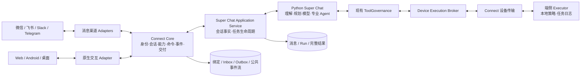

# Connect 总体架构与协议设计

版本：Draft 0.4，2026-09-06。管理 API 版本：`connect.v1`。状态：消息接入基础版已实现；本文中的完整命令/事件协议、设备执行与富媒体能力仍是目标架构。当前可用范围与部署方式见 [Connect 实现与接入说明](./connect-implementation.md)。

## 1. 定位与关键决策

**Super Chat 是统一智能底座，Connect 是把用户、消息渠道和端侧设备连接到它的接入基础设施。** 微信、飞书、Slack、Telegram、Web、桌面和未来设备均使用相同的会话、任务、权限与结果模型。专业 Agent 由 Super Chat 在内部编排，渠道不另建一套 Agent 路由和记忆。

产品约束：**不同平台/来源使用独立 Conversation；Connect 是导航栏一级功能，提供已支持端的连接入口，以及已有连接的检测、Disconnect 和重新连接。** “统一会话模型”指共同的数据与行为契约，不表示不同来源共用一个会话。

本文件是 Connect 的上层架构与协议约束；[微信与飞书方案](./connect-wechat-feishu-design.md)作为首批 adapter 的实施细则。原方案中的“为渠道选择其他 Agent”收敛为 Super Chat 内部路由，不是 Connect 的职责。此前工期只涵盖首批消息渠道，不覆盖完整设备执行体系。

先稳定六个边界：

1. **身份与受众**：谁发起、属于哪个账号、哪些人会看到结果。
2. **会话与运行**：在哪个会话里、哪个任务、哪次执行尝试。
3. **内容**：表达什么事实和产物，与平台格式分离。
4. **能力**：端点可提供什么、当前获准使用什么。
5. **控制与事件**：提交、受理、取消、授权、完成的明确语义。
6. **交付与恢复**：发往哪里、如何展示、失败后恢复到哪一步。

首版是 Go Gateway 内的模块化实现，加 Python Super Chat runtime。逻辑边界先划清，不要求立即拆成多个微服务、消息总线或插件市场。

## 2. 端点角色与系统边界

一个端点可以具备多个角色，但每个角色独立授权。

| 概念 | 含义 | 示例 |
| --- | --- | --- |
| Connector | 平台/协议实现及其版本 | 飞书 adapter、Telegram adapter、原生设备 adapter |
| ConnectorInstance | 已配置的一次集成，关联应用/机器人身份及凭据引用 | 某租户的飞书机器人、某个微信 bot；不是一条 TCP 连接 |
| Endpoint | 平台登记的稳定逻辑端点，包含角色和受众边界 | 某 IM 对话、某桌面客户端、某注册设备 |
| Connection | 临时网络连接及租约 | WebSocket 连接；断线重连不能新建用户或会话 |
| `messaging` 角色 | 通过外部平台收发消息 | 微信、飞书、Slack、Telegram 的对话入口 |
| `interactive` 角色 | 展示结构化内容和控制交互 | Web、Android、桌面/设备上的交互 UI |
| `executor` 角色 | 执行明确授权的结构化任务 | 笔记本上的文件读取、受限进程任务 |

“连接机器”首版可先支持交互角色；执行角色是独立的后续能力。协议允许一台设备同时提供两种角色，不把设备默认当作远程 shell。



职责约束：

- Connect 不选择模型、不规划工具、不写长期记忆。它输出已认证、标准化的用户输入，接受标准化的公共运行事件。
- Super Chat 不包含 `if channel == wechat` 一类平台 API 分支。可接收由服务端生成的展示偏好与受众约束；最终兼容由 renderer 保障。
- Application Service 抽取当前 ChatHandler 的业务，统一用户消息、权限、上下文和结果持久化；Web 与 Connect 共用它。
- Adapter 不读写其他用户的会话/记忆，不自行重跑任务。设备结果经 Broker 验证后作为工具结果返回 Super Chat，不能直接冒充最终答案。
- 逻辑上共用认证与资源服务，但面向用户的事件订阅和面向设备的执行派发是两种不同的授权通道。

## 3. 核心对象与标识

| 对象 | 稳定标识与主要语义 |
| --- | --- |
| Principal | `account_id`、`subject_id`、主体类型；区分人、设备和服务主体 |
| Binding | 经验证的外部主体/端点到账号与资源域的映射，可撤销 |
| Source | `source_id`：服务端登记的稳定请求来源，区分平台、集成实例、外部身份和对话/设备作用域 |
| Conversation | 用户意图与上下文的持久容器；不等于 IM chat ID 或网络连接 |
| Turn | 同一来源的一次逻辑用户请求；仅该消息的传输重投复用原 `turn_id`，新消息有新 turn |
| Run | 一次执行尝试，关联 turn；用户明确重试产生新 run 并记录原因 |
| Message | 会话中的事实记录；草稿/状态/授权控制不伪装成 assistant 消息 |
| Answer | 一个已提交回答及结构化内容版本，关联源 Message 和 run |
| Delivery | 某份内容向某个端点的一次逻辑交付，可能映射多条外部消息 |
| Resource | 图片、文件、报告等受控资源；引用稳定，访问权限动态校验 |
| Execution | 一次端侧工具执行，独立于外层 run，带冻结参数与期限 |

内部 ID 均作为不透明字符串处理，不通过字符串前缀猜权限。外部地址由 adapter 管理的 `ExternalRoute` 表达：`connector_instance_id + tenant/bot namespace + peer_id + thread_id?`，所有外部 ID 按字符串存储。

一份 Answer 可以投递到多个端点，每个端点有独立 Delivery；**默认仅回复发起端点**。其它已授权客户端可以读取会话，但不会因订阅就自动推送到所有 IM。

## 4. 身份、来源隔离与 Connect 管理

### 4.1 权威身份

渠道请求经平台认证、消息来源验证与 Binding 解析后，由服务端生成 Principal。原生客户端使用项目账号认证，设备使用登记后颁发的设备凭据；协议包内自报的 `account_id`、`user_id`、角色或 scope 均不能授予权限。

注册凭据只证明“哪台设备/哪个应用”，不等于“哪个人刚刚批准了操作”。共享设备的 executor 身份尤其不能代替用户授权。

### 4.2 来源与会话策略

来源由服务端根据已验证连接解析，不能由请求 body 任意指定：

```text
source_scope = account_id + connector_kind + connector_instance_id
             + platform_namespace + peer/thread/sender_scope
             + native_client_or_device_id（原生端适用）
source_scope -> 稳定 source_id
source_id + session_epoch -> conversation_id
```

`platform_namespace` 区分租户/机器人身份；外部对话、话题与发送者的具体作用域由 adapter 规范化。不同平台、机器人实例、对话/话题、发送者或独立注册的交互设备不能共享 source。Web 同一登记客户端的多标签页可以属于同一来源；刷新和网络重连不会产生新 source。设备注册 ID 不使用临时 socket ID。

- 每个来源拥有独立 Conversation，不提供跨来源绑定或继续同一个会话的功能；即便用户在微信和飞书发送完全相同的文本，也分别创建消息、turn 与 run。
- 同一来源的新消息可以延续该来源当前 Conversation，每条新消息创建新 turn。v1 不将多条短消息自动合成一个 turn；批量请求必须是客户端显式提交的一次请求。
- 同一来源内的 Conversation 串行运行，新 turn 排队；取消与授权走独立控制入口。
- `/new` 增加该来源的 session epoch，创建新的 Conversation，保留旧历史。不会影响其他来源。
- 同一平台身份断线重连/重新授权可恢复原 source 及其会话；换号、换租户或换设备必须建立另一 source，不继承旧来源会话。
- Web 工作台可按账号权限查看各来源历史、状态及审批，但从 Web 发起新聊天仍进入 Web 自己的 Conversation。读取/管理历史不等于跨来源继续聊天。
- 同账号长期记忆仍遵循既有产品与权限策略；独立会话意味着不混入其他来源的短期消息、摘要和运行。群聊保留独立资源域限制。
- Binding 的版本在受理时冻结，在执行/交付前再次检查撤销状态。解绑后不继续发送排队结果。

受众是安全边界：个人会话不能直接绑定到共享群。群聊使用群资源域和专门会话；个人记忆/个人 Drive 不因群内同账号发言而自动注入。把私聊结果发到另一个平台或群，是有明确目的地的交付操作，需要现有权限策略允许。

### 4.3 会话、turn 与重投示例

| 到达的请求 | Conversation | Turn / Run 行为 |
| --- | --- | --- |
| 微信来源 A 的消息 `m1` 首次到达 | `conv_weixin_A` | 新建 `turn_1`，执行 `run_1` |
| 微信来源 A 的同一 `m1` 因网络重投 | 仍为原 `conv_weixin_A` | 返回原 `turn_1`，不再运行 |
| 微信来源 A 发送新消息 `m2`，文本与 `m1` 相同 | 当前 `conv_weixin_A` | 新建 `turn_2` 与 run |
| 飞书来源 B 发出相同文本，平台消息 ID 恰好也叫 `m1` | 独立 `conv_feishu_B` | 新建 `turn_3` 与 run，不与微信去重 |
| 来源 A 执行 `/new` 后，旧 `m1` 再次重投 | 定位原 Conversation | 返回原 turn，不注入新会话 |
| 已生成答案投递失败后重试 | 不变 | 只重试原 Delivery，不创建 turn/run |

入站去重键为 `source_id + external_message_namespace + external_message_id`；原生命令以 `source_id + principal + command_type + idempotency_key` 为作用域。不能只按全局消息 ID、用户 ID 或文本 hash 去重。payload hash 用于检查同一幂等键是否被不同参数复用。

去重查询先于当前 session epoch 路由，并保存原 conversation/turn 映射；`/new`、连接重建和凭据轮换不能改变旧消息的归属。source 和输入日志保留稳定引用，断开连接不清除去重记录。

### 4.4 导航与用户操作

现有工作台侧栏增加一级 `Connect`，与 Super Chat、Pulse、Todo、Drive 等主入口同层级；不放进配置或开发者折叠菜单。沿用当前 `data-view` 页面切换模式，拟议视图为 `connect`，桌面/移动侧栏均可进入。

Connect 页面分为两个区域：

- **我的连接**：展示当前用户已创建的连接卡片。包括平台图标、用户自定名称、绑定账号/设备摘要、连接状态、最近检测结果与时间、最近成功收发时间，以及“连接检测”“Disconnect”“重新连接”等适用动作。详情可以查看独立来源会话历史，但没有合并会话选项。
- **可连接的端**：从服务端支持目录展示已实现且当前部署启用的端；用户选择后进入该端的扫码、凭据授权或设备配对流程。尚未实现的 Slack/Telegram/设备能力不出现可点击 Connect 按钮，路线图条目与支持目录分离。

空状态说明“还没有连接，选择下方支持的端开始”。同平台可连接多个账号/实例，各自有连接卡片与独立来源，不因已有一条连接禁用整个平台入口。

```text
导航：…  Drive  Connect  …

Connect
  我的连接
    飞书 · 工作账号   已连接   最近检测：刚刚
      [连接检测] [详情] [Disconnect]
    微信 · 个人账号   需要重新授权
      [连接检测] [重新连接] [Disconnect]

  可连接的端
    [飞书：Connect] [微信：Connect] [其他已支持端：Connect]
```

Connect 流程：选择支持的端 → 完成该端授权 → 服务端验证身份/权限 → 建立连接与来源 → 检测 → 显示结果。首次用户消息到达时再创建当前来源 Conversation，连接向导不制造一条空聊天历史。重复点击同一授权事务幂等返回原连接。

### 4.5 连接生命周期与检测

产品中的“连接”对应 ConnectorInstance/设备注册及其稳定绑定；临时网络 Connection 在内部管理。分别保存期望状态 `enabled/disconnected`、观测状态和诊断，避免重连 worker 与用户 Disconnect 互相覆盖。

| UI 状态 | 含义 | 用户操作 |
| --- | --- | --- |
| 连接中 | 授权或建连尚未完成 | 取消连接流程 |
| 已连接 | 配置启用且当前必需连接检查通过 | 检测、详情、Disconnect |
| 连接异常 | 网络/权限/通道异常或检查结果过期 | 检测、按错误引导恢复、Disconnect |
| 需要重新授权 | 凭据无效或授权被撤销 | 重新连接、Disconnect |
| 正在断开 | 本地已禁用，正在关闭传输和处理在途任务 | 查看处理状态 |
| 已断开 | 用户主动停用；禁止后台自动重连 | 重新连接、查看历史 |

“连接检测”创建有超时的只读探测任务，检查配置、凭据、网络、必需权限、入站订阅/心跳及出站 API 可用性；不发起 Agent run、不发送聊天消息、不执行设备工具。无无副作用探测接口时返回“未验证”，不能拿历史发送成功冒充当前已验证。

诊断结果逐项返回 `passed/failed/unknown/not_applicable`、`checked_at`、公开原因与建议动作，区分当前探测与历史成功记录。凭据和错误堆栈不出现在页面。若用户需要端到端验证，另提供明确的“发送测试消息”操作并显示目标；设备执行验证不包含在默认连接检测里。

检测不等于重连：已断开的连接做检测也保持 disconnected。每次探测绑定连接 generation；如果检测过程中发生 Disconnect/重新授权，旧探测结果可留作记录，但不能把新状态改回已连接。对连续点击合并活跃检测并限流，不重复拉起连接。

### 4.6 Disconnect 的确定语义

1. 幂等提交 Disconnect，将 `desired_state` 持久化为 disconnected 并推进授权 generation；立即禁止新入站受理、自动重连、新投递和设备新派发。
2. 停止轮询/订阅、关闭 socket、失效本地绑定授权和登录事务；已有凭据引用停止使用，平台支持时执行注销/撤销。平台注销失败单独报告，本地停用仍生效。
3. 当前来源尚未执行的 turn 取消；正在执行的 run 请求取消，相关 approval ticket 失效。已完成答案及会话历史保留，未发送 Delivery 标记 revoked。
4. 取消是协作过程，无法撤回平台已受理消息或已发生工具副作用。已在发送中的请求/设备任务等待核对，UI 显示在途状态，不能声称全部副作用已停止。
5. 保留历史、诊断与去重墓碑。重新连接须再次验证授权和外部身份；同一身份可恢复其来源会话，但不自动补发此前 revoked 消息或重跑已取消任务。

用户只 Disconnect 自己的连接与绑定；若未来多个用户共用一个平台机器人，普通用户停用自己的绑定，不能关闭共享传输。共享实例的全局 Disconnect 另限管理员执行。

### 4.7 管理 API 契约

以下为拟新增 REST 管理接口；它们经同一权限与幂等层处理，与聊天 Command 协议区分，`connection_id` 指稳定的产品连接资源 ID：

| API | 作用 |
| --- | --- |
| `GET /api/connect/v1/catalog` | 已支持、已启用且用户可接入的端，以及授权方式与能力摘要 |
| `GET /api/connect/v1/connections` | 当前用户的连接列表和最新状态 |
| `POST /api/connect/v1/connections` | 幂等创建连接授权事务，返回连接 ID 与下一步动作 |
| `GET /api/connect/v1/connections/:id` | 详情、授权流程状态及诊断摘要；不返回凭据 |
| `POST /api/connect/v1/connections/:id/check` | 创建/复用有界探测，返回 check ID；结果独立查询 |
| `GET /api/connect/v1/connections/:id/checks/:check_id` | 分项探测状态与结果 |
| `POST /api/connect/v1/connections/:id/disconnect` | 幂等停用，返回本地禁用状态和在途清理状态 |
| `POST /api/connect/v1/connections/:id/reconnect` | 新的授权/重连事务，验证同一外部身份后恢复 |

所有管理接口使用有效项目账号 session、资源所有权和适用的 CSRF 防护。adapter 内实现 `Check`、`Disconnect`、`Reconnect` 生命周期钩子；新渠道无需在页面硬编码另一套管理动作。取消未完成的连接向导复用 Disconnect 终止登录事务。

## 5. 能力协商：能力不是权限

`EndpointDescriptor` 分为角色、内容能力、操作能力、限制和健康状态。协议字段是能力名，不写死平台判断：

```json
{
  "endpoint_id": "ep_demo",
  "roles": ["interactive"],
  "protocol_versions": ["connect.v1"],
  "capability_revision": "cap_7",
  "content": {
    "input": ["text", "image", "file"],
    "output": ["text", "list", "table", "image", "file"],
    "answer_preview": "replace"
  },
  "operations": ["conversation.submit", "run.cancel", "approval.resolve"],
  "delivery": {
    "receipts": ["accepted", "rendered"],
    "idempotency": "logical_delivery_id"
  },
  "limits": {
    "envelope_bytes": 262144,
    "max_inflight": 16
  }
}
```

示例值描述本项目拟议原生端，不代表任何外部平台。外部平台还需声明字符计量方式、消息字节上限、文件限制、编辑条件和配额维度；未知值显式为 unknown，不能视为无限。

有效能力 = 实现能力 ∩ 双方版本能力 ∩ 已授权范围 ∩ 当前上下文限制。健康状态决定能否调度，用户展示偏好进一步约束渲染。设备/客户端自报能力只能缩小可用范围，不能扩大服务器授权。发消息时 adapter 再校验目标和当前限制；能力变化产生新 revision，不能沿用失效能力。

预览策略只有几种稳定语义：`none`、`replace`、`append`。状态提示、正文预览、最终交付分别协商；微信可仅选择最终消息，飞书等可用原位更新。Slack 和 Telegram 提供消息编辑接口，但编辑条件与限流仍由 adapter 判断，不能凭平台名承诺所有消息都可编辑。[Slack chat.update](https://docs.slack.dev/reference/methods/chat.update/)、[Telegram editMessageText](https://core.telegram.org/bots/api#editmessagetext)

可选能力缺失时有确定性降级；必需能力（例如用户明确指定的设备操作）缺失时返回错误，不能悄悄在别的设备执行。

## 6. Connect v1 协议边界

协议使用 UTF-8 JSON，时间使用带时区的 RFC 3339 字符串，标识与游标为不透明字符串。JSON 包负责控制和小型内容，大文件不内嵌 base64。以下为协议设计样例，尚不表示已提供 JSON Schema、SDK 或可调用端点。

分开定义三类包：

- **Command**：请求做一件事，需要鉴权、幂等、期限和明确响应。
- **Event**：已发生的事实，可订阅和按规则回放；事件不能被客户端用来伪造命令成功。
- **Receipt**：受理/交付确认；不等于业务执行完成。

采用项目自己的轻量 envelope；借鉴 CloudEvents 的事件标识与来源概念，但不宣称兼容其完整规范，也不把事件 envelope 当作 RPC、队列或执行权限协议。[CloudEvents 1.0.2](https://github.com/cloudevents/spec/blob/v1.0.2/cloudevents/spec.md)

### 6.1 命令格式

```json
{
  "protocol_version": "connect.v1",
  "kind": "command",
  "id": "cmd_01",
  "type": "conversation.submit",
  "idempotency_key": "client_request_01",
  "expires_at": "2026-09-06T10:05:00Z",
  "payload": {
    "conversation_id": "conv_demo",
    "content": {
      "schema_version": "content.v1",
      "blocks": [{"id": "b1", "type": "text", "text": "比较这三个方案"}]
    },
    "resource_refs": []
  }
}
```

会话不存在、不属于当前身份或其 `source_id` 与服务端解析的当前来源不符时拒绝；新会话通过 `conversation.create` 建立。不能只验证账号相同就允许跨来源提交。命令不接受任意外部目标 URL、任意执行设备或高权限 Agent 配置；目的地来自已授权 Binding，设备要求另经执行策略解析。

| Command | 语义 |
| --- | --- |
| `conversation.create` | 创建符合当前来源/受众/资源域的会话，不接受跨来源关联 |
| `conversation.submit` | 原子保存用户输入与待执行 turn，不等待模型结束 |
| `run.cancel` | 请求停止指定 run；已完成则返回现有终态，不能假装撤销已发生副作用 |
| `approval.resolve` | 处理冻结参数 ticket，校验真实用户与一次性消费 |
| `subscription.open` / `subscription.ack` | 建立授权投影订阅、确认已持久化处理的连续游标 |
| `delivery.retry` | 重投已有结果，区别于重新生成；明确处理未知发送结果 |
| `endpoint.hello` / `endpoint.heartbeat` | 协商版本、角色、能力与在线状态；不能在 hello 中完成权限授予 |
| `execution.accept` / `execution.report` | 仅 executor 身份使用，确认接单或报告结构化工具结果 |

`accepted` 只在命令、幂等记录和后续工作意图已持久化后返回：

```json
{
  "protocol_version": "connect.v1",
  "kind": "receipt",
  "command_id": "cmd_01",
  "status": "accepted",
  "result": {"turn_id": "turn_01", "queue_position": 1}
}
```

相同来源/主体/命令类型/幂等键且 payload hash 相同，返回原受理结果，不创建新 turn；hash 不同返回 `idempotency_conflict`。不同来源的相同 key 分别受理。标识与去重墓碑的保留策略必须覆盖有效重试期限；原命令过期后即使清理详细记录也拒绝当新请求执行。IM 重投以来源作用域内的外部稳定消息 ID 去重并校验平台事件时间，不因 adapter 重启生成新幂等键。

### 6.2 公共事件格式

```json
{
  "protocol_version": "connect.v1",
  "kind": "event",
  "id": "evt_104",
  "type": "answer.committed",
  "source": "super_chat",
  "time": "2026-09-06T10:01:12Z",
  "correlation_id": "turn_01",
  "causation_id": "cmd_01",
  "scope": {"conversation_id": "conv_demo", "run_id": "run_01"},
  "stream_id": "stream_public_demo",
  "cursor": "cursor_104",
  "payload": {
    "message_id": "msg_01",
    "answer_id": "ans_01",
    "revision": 1,
    "content_ref": "res_answer_01"
  }
}
```

身份上下文由服务端持有，不在每个外部事件中广播账号信息。`source` 表达来源，不构成可信身份声明；只有服务端有权产生 run/answer 终态事件。

最小公共事件集：`turn.accepted`、`run.started`、`run.status_changed`、`approval.required`、`approval.resolved`、`answer.committed`、`run.completed`、`run.failed`、`run.cancelled`、`run.interrupted`、`delivery.status_changed`。面向管理端的 endpoint 状态、面向 executor 的派发记录使用独立权限的流。

顺序与一致性约束：

- 一个 run 只有一个终态；结果提交先于 `run.completed`，完成后旧预览不能覆盖答案。需要修改已提交答案时创建显式新 revision 和审计记录，不能悄悄改内容。
- 公共事件由持久化事实经事务 outbox 发布，不在数据库提交前发送“成功”。跨 Go/Python 使用幂等受理和结果核对，不假设分布式事务。
- 无全局事件顺序承诺。每条授权投影流提供有序持久化游标；过滤后的客户端不使用内部全量 trace 序号判断是否丢事件。
- 流传输至少一次，消费者按 event ID 去重；ACK 只推进连续处理游标，不能跳过未处理事件。
- 内容资源在事件可见前已持久化，并具有同等或更严格 ACL；获取 `content_ref` 仍需鉴权。

### 6.3 草稿与最终答案分流

高频草稿使用可丢弃的 `answer.preview` 帧：`answer_id + preview_revision + full_snapshot`。它不占必须回放的公共事件游标，断线后拉最新快照即可。v1 优先全量替换，未来需要 token delta 时协商额外能力与 base revision，不能无条件向旧客户端发送增量。

状态显示取公共状态事件的最新值，可合并中间版本；原始 reasoning、工具敏感参数、内部 trace 和隐式记忆不属于公共协议。`provisional_token/intermediate` 通过 runtime mapper 处理，不直接成为公共最终答案。

### 6.4 统一错误

错误包含 `code`、可公开 `message`、`retryable`、可选 `retry_after_ms`、`correlation_id`。不返回凭据、原始堆栈或私有工具参数。

固定首批错误：`unauthenticated`、`permission_denied`、`not_found`、`invalid_payload`、`unsupported_version`、`unsupported_capability`、`idempotency_conflict`、`expired`、`rate_limited`、`endpoint_offline`、`resume_required`、`delivery_unknown`、`execution_unknown`。是否可重试还需结合命令副作用和原任务状态；不能对所有 5xx 自动再执行工具。

## 7. 传输与恢复

协议语义与传输分离：

| 接入方式 | 传输绑定 | 恢复方式 |
| --- | --- | --- |
| 消息平台 | 原生 Webhook / WebSocket / 长轮询，由 adapter 转换 | 平台 ACK/游标 + Inbox + Outbox |
| Web/移动客户端 | HTTPS Commands + SSE Events | 稳定 command key + 服务端游标回放 |
| 原生双向客户端/设备 | 主动向 Gateway 建立 WSS，JSON 帧 | hello/version + 重认证 + 订阅恢复 + execution 核对 |

拟议路由为 `POST /api/connect/v1/commands`、`GET /api/connect/v1/events`、`GET /api/connect/v1/conversations/:id/snapshot` 和 `/api/connect/v1/socket`。这是 Application Service 外面的统一协议入口；内部 adapter 可直接调用同一 dispatcher，无须 HTTP 回环。

SSE 的 `id` 对应授权流 cursor；客户端按已处理位置重连，原生 EventSource 无法附加自定义认证头时使用受保护 cookie 或 fetch 流，不把长期凭据放 URL。WebSocket 的 hello 在认证成功后进行，浏览器场景校验 Origin，命令入口做相应 CSRF 防护。

持久化事件设计保留 7 天作为初始参数；超过保留期返回 `resume_required`，提供与 barrier cursor 一致的授权快照，再订阅 barrier 之后事件。快照与游标需同一逻辑读点，避免快照和订阅之间丢更新。ACL 改变后使原订阅失效，不能沿旧 cursor 继续读取已撤销内容。

建议心跳 20s、连续 3 次未响应标记 offline，断线指数退避加抖动。以上是本项目默认值。在线不等于执行权限有效；暂时断线不取消 Super Chat run。

每账号、端点和订阅限制队列与在途数量。先合并/丢弃草稿，再暂停推送并要求恢复；不得静默丢最终结果和授权事件。取消、到期和授权控制不能被长文件上传或正文预览堵塞。文件单独传输。

## 8. 内容与交付协议

`ContentDocument content.v1` 是事实与展示的中间结构：`text/heading/list/table/code/quote/image/file` blocks、citations、artifacts。块有稳定 ID，未知可选块必须带安全的纯文本 fallback；缺少 fallback 且不能表达时明确显示不支持并提供详情，不能静默删数据。

表格携带列名、原始值、单位、行和来源。原始 Markdown 继续保存；首版由 AST 确定性派生 blocks，不能为微信/飞书分别调用模型重写数字。照片、导出文件等只用受控 ResourceRef，含 MIME、大小和 hash；短期下载凭据在鉴权时生成，不能作为持久身份。

交付规划：

```text
Answer + 当前端点能力 + 用户偏好 + 受众策略
    -> DeliveryPlan(version, source_hash, capability_revision)
    -> text / update / image / file 等有序分项
    -> adapter 执行并登记平台回执
```

微信：完整文本/字段列表/表格图片。飞书、Slack、Telegram：能力允许时原位预览或更新，最终按各自格式提交。Web/桌面：原生 blocks 与完整表格。复杂大表统一提供完整文件或已鉴权详情。渠道具体语法和大小限制留在 renderer/adapter。

`delivery.accepted` 表示平台/原生端持久化受理；`rendered/read` 只有对端可明确报告时才使用，且不能作为业务执行成功证据。最终投递不成功不重跑 Super Chat。平台已发送但回执丢失时进入 unknown，使用可用幂等/核对能力；不存在能力时不宣称 exactly-once。

历史查看与主动推送分离：管理端订阅用于读取已有权限下的状态，不允许跨来源继续聊天。DeliveryPlan 决定主动通知的具体目标，默认主回复目标冻结于 turn；额外转发目标需单独授权与记录，转发内容不会把目标来源绑定到原会话，不能由模型根据自由文本伪造路由。

## 9. 端侧 Executor 扩展

### 9.1 设备登记与授权

设备通过项目账号发起的一次性配对流程登记，生成设备密钥并获得短期、可撤销、限定受众的连接凭据。配对码有期限和防重放限制；私钥留在设备系统密钥存储。密钥轮换保持 device ID，撤销立即阻止新派发。

设备上报工具描述与输入/输出 JSON Schema，Broker 只接纳显式配置允许的工具。服务器审批、用户权限和设备本地策略共同约束执行；设备可以进一步拒绝请求，不能扩大范围。设备提供的工具说明和工具结果都作为不可信外部数据处理。

首版执行工具建议从 `files.read` 等窄接口起步；资源范围使用设备本地映射的 root alias，并防止符号链接/路径穿越。通用 shell、安装软件、持久进程控制等单独设计治理策略，不因协议预留 `executor` 自动开放。

### 9.2 派发协议

Broker 在 ToolGovernance 允许后生成执行请求，示例：

```json
{
  "protocol_version": "connect.v1",
  "kind": "command",
  "id": "cmd_exec_01",
  "type": "execution.invoke",
  "idempotency_key": "exec_01",
  "expires_at": "2026-09-06T10:05:00Z",
  "payload": {
    "execution_id": "exec_01",
    "run_id": "run_01",
    "device_id": "device_demo",
    "tool": "files.read",
    "tool_version": "1",
    "arguments": {"root": "selected_workspace", "path": "README.md"},
    "lease_epoch": 4,
    "grant_ref": "grant_exec_01",
    "max_output_bytes": 65536
  }
}
```

这是服务端到 executor 的命令，普通用户 dispatcher 不允许直接提交 `execution.invoke`。grant 绑定用户、设备、工具版本、参数 hash、资源范围、期限与授权 ticket；通过鉴权通道验证/兑换，不能只相信字符串引用。

执行流程：本地校验 → 持久化接单 → `execution.accept` → 执行 → 持久化结果 → `execution.report` → Broker 校验并确认。结果含执行 ID、lease epoch、状态、结构化 output/ResourceRefs 和错误，不含可进一步授予权限的自由文本指令。

每个 execution ID 的参数冻结，重投返回本地记录。接单 ACK 不等于完成；状态为 `queued/running/succeeded/failed/cancel_requested/cancelled/expired/unknown`。设备离线时只允许策略明确批准、仍在期限内的任务排队；到期不再启动。执行中的总时限、输出上限和取消由本地 watchdog 实施。

### 9.3 断线与副作用

- 重连先核对已接受 execution 的状态，再派新任务；同 ID 不自动启动第二份进程。
- 网络失联、租约失效或取消到达时，本地阻止新步骤并尽力停止运行，无法确认的结果标为 unknown。
- lease epoch 阻止旧连接接受新派发或向活跃 run 注入过时完成；旧结果可存为审计事实，需核对后才能推进任务。
- fencing 不能撤销已发生的文件写入或外部操作。不能仅靠“换新 epoch”把同一副作用改派另一台机器执行。
- 离线设备无法被服务端瞬间强制终止，依靠短期 grant、本地时限和本地取消协作限制执行；UI 不把发出取消请求显示为已经停止。
- 执行结果经过 Resource ACL 和受众检查后再进入回答，不能把本机完整文件默认广播到所有端。

## 10. 协议版本与扩展规则

- `connect.v1` 表示主版本契约。新增可选字段/能力保持兼容；修改必填字段、状态语义或权限语义需要新主版本。
- hello 选择双方支持的主版本，确认 capability revision；不兼容明确拒绝连接业务层，不猜测字段含义。
- 未知 Command type 必须拒绝。未知的已声明可选展示事件可以跳过并 ACK；授权、终态、执行等核心事件不得静默忽略，协商失败则拒绝该 profile。
- 每个 operation、event、content block 有独立 schema；扩展用命名空间和明确版本，不能通过任意 `metadata` 绕过身份/权限/生命周期规则。
- 各 SDK 从单一 schema 源生成 Go/Python/TypeScript 数据结构，并保留跨语言黄金样例；大整数不得依赖 JavaScript 浮点精度。
- 原生客户端做 N/N-1 兼容测试；平台 adapter 的版本独立于协议版本，升级 adapter 不应修改 Super Chat 核心。

与已有协议的关系：`connect.v1` 管外部身份、交互、订阅和交付；现有 `agent_input.v1` 管 Super Chat 向专业 Agent 传递上下文。两者通过 Application Service 映射，不共用同一个 DTO。[现有 Agent Input Protocol](./agent-handoff-protocol.md)

## 11. 代码与存储落点

拟议目录按职责划分，首版只实现需要的模块：

```text
protocol/connect/v1/                 # schema / examples / compatibility fixtures
gateway/internal/chat/               # Application Service
gateway/internal/connect/core/       # identity / sessions / commands / capabilities
gateway/internal/connect/events/     # authorized projections / replay / snapshots
gateway/internal/connect/delivery/   # inbox / outbox / receipts / reconciliation
gateway/internal/connect/render/     # content / profiles / delivery planner
gateway/internal/connect/adapters/   # feishu / weixin / slack / telegram / native
gateway/internal/connect/devices/    # registry / grants / execution broker（后续）
agent/runs/                          # runtime request dedupe / durable results
device/                              # independent executor client（后续）
```

旧方案的 `channel_*` 表名称在实施前调整为中性 `connect_*`：至少涵盖 connector_instances、endpoints、bindings、sources、session_links、inbox、turns、outbox、message_links、public_events、subscriptions、connection_checks。source_scope、`source_id + session_epoch` 与来源范围内消息去重键分别设唯一约束；Conversation 保存稳定 source 归属，提交时检查。连接记录保存 desired_state、generation 与诊断时间，临时 Connection 租约不写成永久会话，credentials 仅存引用。设备阶段再加 devices、grants、executions，用户会话与运行事实继续使用已有业务模型。

当前 Python 活动 run 和 trace 主要在内存中，必须补受理幂等与完整结果持久化；仅增加 Connect 事件表不能使工具执行具备重启恢复。Go/Python 结果协调使用稳定 turn/request ID、唯一约束和补拉接口，副作用未知时标记 interrupted/unknown，不静默重试。

## 12. 落地顺序与架构验收

| 阶段 | 范围 | 退出条件 |
| --- | --- | --- |
| A：协议骨架 | 固定对象/状态/错误、JSON Schema、命令 dispatcher、fake messaging/interactive/executor | schema 样例与三个 profile 的契约测试通过，fake executor 不连接真实机器 |
| B：Super Chat 统一入口 | ChatService 抽取、现有 Web 兼容、durable turn/result、会话和授权 | Web 与 Connect 同权限/同事实源，重投不多跑 |
| C：首批渠道 | 飞书、微信 adapter + renderer + inbox/outbox；Connect 一级页面、支持目录、检测和 Disconnect | 完整答案、表格、来源隔离、取消/审批、连接管理与异常恢复通过 |
| D：多端证明 | Slack 或 Telegram 一个真实 adapter，原生交互端的独立来源接入 | 不改 Super Chat 核心；来源严格隔离，管理界面由支持目录驱动 |
| E：设备执行 | 登记/撤销、窄工具、grant、本地日志/时限、断线核对 | 副作用不盲重放、未知状态可见、权限可审计 |

现在先定义 executor 边界并用 fake 验证，不必提前实现完整远程执行平台。首批渠道工期沿原专项方案估算；协议 SDK、额外渠道和端侧执行待 A 阶段确认范围后分别估算。

强制契约/单元测试清单：

- 同一输入在不同 adapter 下产生统一结构但不同 source/Conversation/Turn 的业务 Command；不同主体不能借同幂等键读取原结果。
- 同来源新消息新 turn、原消息重投原 turn；跨平台/实例/对话/设备同 ID 不互相去重，`/new` 后旧消息重投仍定位旧会话。
- 同来源会话并发请求保持顺序；跨来源指定同账号 Conversation 仍拒绝，群受众和默认回复目标正确。
- Connect 在桌面/移动导航中为一级入口，支持目录只允许选择已实现启用端，空状态、多连接与所有权隔离正确。
- 检测不发送消息/不启动 run，未验证能力如实显示；超时、限流、检查中 Disconnect/重新授权均不恢复过期状态。
- Disconnect 幂等、禁止自动重连、停止新工作、失效审批；保留历史与去重，同身份重新连接不重放已撤销投递，不影响其他用户连接。
- 版本不兼容、未知命令、未知可选展示块、缺失必需能力分别按契约处理。
- 至少一次回放不重复改变状态；cursor 过期快照恢复无缝；撤权后既不可回放也不可取资源。
- 200 个 token 与多次工具事件只产生一个最终 Answer；不同 renderer 保留相同数值与引用。
- 最终更新与旧预览竞态、Outbox 崩溃窗口、第三方未知回执不会重复运行 Super Chat。
- 设备伪造授权、参数修改、重复接单、旧 lease 回报、离线过期、取消竞态均被校验；结果未知不自动重执行。
- 限流时控制命令可达，草稿可丢、终态可恢复；所有健康/状态 UI 区分在线、受理、执行、投递与阅读。

每阶段 feature 必须同步单测，先跑局部测试，再跑 `./scripts/test.sh`。本次仅文档设计，校验文档链接、JSON 样例与结构，不代表上述运行能力已实现。

最终架构验收标准：**新增一个消息渠道只需 adapter、渲染 profile 和契约测试；新增一种设备能力只需执行工具描述、策略与实现，不修改 Super Chat 的会话和消息协议。** 需要新增真正的业务语义时，通过有版本的公共协议演进完成。
