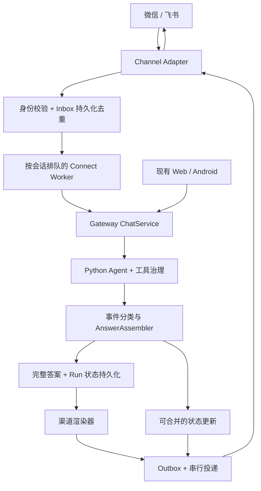

# Connect 技术方案：将项目 Agent 接入微信与飞书

日期：2026-09-06。状态：文字私聊基础版已实现，尚未接入真实账号联调；以下为目标设计。当前版本两端均采用最终文本交付，飞书卡片、图片/文件回退等后续能力请勿视为已实现。实际入口、限制和配置见 [Connect 实现与接入说明](./connect-implementation.md)。

架构定位更新：本文件作为首批微信/飞书 adapter 的实施细则；统一抽象、Super Chat 底座、来源独立会话、Connect 一级导航与连接管理、设备执行边界以 [Connect 总体架构与协议设计](./connect-architecture-protocol.md) 为准。专项工期不包含完整设备执行体系。

本文以当前工作区代码为基线，结合 OpenClaw、腾讯微信插件及飞书官方资料。文中的超时、分段、刷新频率和工期是本项目建议值；平台能力、源码配置和待实测项目分别标明，避免把插件默认值当成平台硬限制。

## 1. 建议决策

**在 Go Gateway 增加统一 Connect Core，以 Python Super Chat 为智能底座；飞书私聊与微信私聊是首批渠道 adapter。** 借鉴 OpenClaw 的渠道适配、会话路由和消息合并设计，不把整个 OpenClaw 作为本项目 Agent 的必经中转。

用户体验约定：

- 微信：默认等最终回答完整生成，再发送一条可读答案；长任务最多补一条状态消息。表格转字段列表或清晰图片，完整数据通过文件或已鉴权的详情页保留。
- 飞书：一轮任务复用一张卡片，显示少量进度，完成后原位替换为完整答案。正文实时预览作为后续可选项，默认不连续新发消息。
- 两端：统一进入 `super_chat`，专业 Agent 由 Super Chat 内部编排；不同平台/来源固定使用独立会话，不提供跨来源继续聊天。每次新消息有独立 turn，只有同来源同消息重投才复用原 turn；生成与投递都有明确终态。
- 首版范围：Connect 一级导航、支持端选择、连接列表、连接检测、Disconnect/重新连接、文本私聊、账号绑定、状态查询、取消、工具授权、可恢复投递、表格降级。微信语音/视频输入、微信群、飞书共享群会话、主动定时推送后续单独立项。

“回复断断续续”首先是交付策略问题，不宜简单归因于模型速度。**模型可以流式执行，用户不必流式接收碎片。**

## 2. 渠道选择与已核实能力

| 入口 | 接入方案 | 首版定位 | 需要注意 |
| --- | --- | --- | --- |
| 飞书 | 企业自建应用机器人，优先官方 Go SDK 长连接收事件，OpenAPI 发消息 | 优先实现，验证完整闭环 | 应用可见范围、事件与发消息权限、卡片权限需逐项验证；自定义群 Webhook 不能替代双向应用机器人 |
| 个人微信 | 参考腾讯 `Tencent/openclaw-weixin` 中 iLink 通信实现 | 第二阶段私聊试点 | 源码声明 `chatTypes: ["direct"]`，不能推定支持微信群；扫码授权、消息上下文和失效重连必须独立管理 |
| 企业微信、微信客服、公众号 | 各自独立的 adapter | 当前不纳入 | 与个人微信不是同一种身份、授权和消息接口，不在一个“微信开关”里混用 |

腾讯已有维护中的微信插件，支持扫码登录；因此不能沿用“个人微信只能靠非官方协议”的旧结论。[腾讯插件说明](https://github.com/Tencent/openclaw-weixin/blob/main/README.zh_CN.md)

插件渠道源码声明了私聊、媒体和分块输出能力，配置的 `textChunkLimit` 为 4000。**4000 是该插件的实现值，不是本文验证过的微信平台字数/字节上限。** 本项目微信首版按纯文本、图片、文件设计，不依赖原位编辑或原生表格。[腾讯渠道源码](https://github.com/Tencent/openclaw-weixin/blob/main/src/channel.ts)

飞书可通过交互卡片更新回复；OpenClaw 的飞书实现也将卡片预览与分块发消息分别配置。[OpenClaw 飞书文档](https://docs.openclaw.ai/channels/feishu) 飞书官方提供[流式更新文本](https://open.feishu.cn/document/cardkit-v1/card-element/content)及[表格组件](https://open.feishu.cn/document/feishu-cards/card-components/content-components/table)文档入口；此次抓取未取得这两页完整正文，具体卡片版本、客户端兼容、配额及表格上限需在 P0 实测，首版必须具备列表回退。

## 3. 现有项目能复用什么

| 当前代码 | 已有能力 | Connect 需要补的边界 |
| --- | --- | --- |
| `gateway/internal/handlers/chat.go` | 会话归属检查、上下文拼接、工具策略、消息存储；客户端写失败后继续消费 Agent 流 | 将公共业务抽成可供 Web 和后台 worker 调用的 `ChatService`，不要复制 handler 或伪造 Gin 请求 |
| `gateway/internal/bridge/agent_client.go` | Python 请求、SSE、查询 run、取消和工具授权代理 | 给后台 worker 提供类型化事件回调和有界超时 |
| `agent/main.py` | `meta/token/provisional_token/intermediate/trace/response/done/error` 事件；运行取消 | 明确事件分类；增加任务受理幂等和持久化结果恢复能力 |
| `agent/schemas/chat.py` | 完整 `response`、`citations`、`artifacts`，以及单独的 `reasoning` | 保留原始回答，另建展示结构；不把所有字段投递到 IM |
| `agent/trace/store.py` | 内存中的 run/event 和运行状态 | 内存查询无法独立支撑跨进程重启恢复；需要持久化受理记录和最终结果 |
| `gateway/internal/models/conversation.go` | SQLite Conversation/Message，回答中保存 run 和 trace | 补渠道映射、消息去重、任务和投递状态；数据库约束防重复写入 |
| `gateway/internal/handlers/user_context.go` | 有效账号 session 优先，但兼容直接传 user ID 和默认账号 | Connect 必须使用已验证的渠道绑定构造身份，禁止进入匿名/default `0` 回退 |
| `agent/aigc/share_card_renderer.py` | 确定性 SVG 排版与比较信息提取 | 当前字段偏旅行场景，不能直接当通用表格渲染器；可借鉴绘制思路 |

现有 Gateway 已有已存消息回查 run 的兜底，但不能恢复尚未持久化的运行。开发文档“当前没有端到端 SSE”的旧描述与现有代码不符，本方案以实际代码为准。

## 4. 推荐架构



Go 负责连接生命周期、身份、队列、渠道限流、消息渲染规划和投递；Python 继续负责模型与工具执行。复杂表格转图可由隔离的渲染 worker 执行，不进入模型主循环。

第一阶段保留两个主服务，在 Gateway 内启动少量后台 worker，使用现有 SQLite 增加 inbox/outbox 表。数据库事务保持短小，启用并验证 WAL、忙等待与单实例租约行为。未来多机部署再迁移 PostgreSQL/专用队列；SQLite 文件不放网络盘做多机队列。

建议接口边界：

```text
ChannelAdapter: Connect / Receive / Send / Update / Upload / Health / Disconnect
IdentityResolver: verified channel sender -> account + policy scope
ChatService: Submit / Subscribe / GetResult / Cancel / ResolveApproval
AnswerAssembler: runtime events -> status / approval / authoritative final
ChannelRenderer: final answer + capabilities -> immutable DeliveryPlan
DeliveryWorker: claim / send / retry / reconcile / mark terminal
```

上述接口为拟新增或抽取的内部接口，并非项目现有 API。能力表应表达 `editable_message`、`native_table`、`image`、`file`、`typing`、大小与长度计量方式；不能仅写一个 `supports_markdown`。

微信直接实现薄 iLink adapter，协议细节参照腾讯源码，实施时固定 commit、保存协议样例和兼容测试。官方插件依赖 OpenClaw SDK，不能假设 npm 包安装后就能独立运行。若移植成本过高，可评估只封装传输的 Node sidecar；它仍不拥有本项目会话、工具策略和最终答案。

## 5. 解决回复断续：分离执行与交付

### 5.1 先定位断续的来源

OpenClaw 区分分块发送、块合并和原位预览，开启分块时还可配置块间延迟；这些机制说明碎片化可能来自交付设置。[OpenClaw 流式与分块](https://docs.openclaw.ai/concepts/streaming)

对用户曾体验的具体版本和配置没有日志，不能断言其问题来源。排查应分别记录：模型首次输出、工具等待、分块 flush、平台限流、网络重试和最终发送耗时。常见现象包括把中间解说当答案发送、工具阶段多次新建消息，以及结束时又重复发送完整答案。

### 5.2 首版默认策略

下列时间都是待试点调优的产品参数，不是平台 SLA。

| 场景 | 微信 | 飞书 |
| --- | --- | --- |
| 短问答，3 秒内完成 | 直接发完整答案 | 直接发最终卡片或文本 |
| 超过 3 秒 | 支持时用 typing；否则等待 | 建一张“正在处理”卡片 |
| 超过 8 秒 | 尚无最终答案时，最多一条“正在整理，完成后发给你” | 在原卡片更新真实阶段 |
| 工具执行 | 不逐工具发消息 | 仅显示“检索资料/整理结果”等白名单阶段 |
| 最终完成 | 发一条完整文本；必要时追加一张表格图片或文件 | 原位提交最终内容并结束流式状态 |
| 正文过长 | 结论 + 详情入口；确需全文时语义分段并编号 | 卡片摘要 + 详情入口 |
| 失败/取消 | 发明确终态；回答已生成则提示交付待恢复 | 原卡片显示失败/取消；保留已成功产物 |

默认消息预算：微信正常回答 1 条；长任务含状态通常不超过 2 条；表格图片等附件可以增加 1 条。此预算是体验目标，不能成为删掉用户要求内容的理由。既无可用详情入口又无法发文件时，按段完整发送。

在队列等待期也能查询状态；状态提醒发送前再次检查最终答案是否已准备，避免“答案先到、处理中后到”。通知失败不会中断 Agent。

### 5.3 以最终 response 为权威

| 现有事件/字段 | Connect 行为 |
| --- | --- |
| `meta` | 关联 run，不发聊天正文 |
| `token` | 只进预览缓冲，首版不转成新消息 |
| `provisional_token`、`intermediate` | 视为非最终阶段；不累加为最终答案，不直接发到微信 |
| `trace` | 仅映射明确白名单状态和已 ready 的 `approval.required`；不转发原始 trace |
| `reasoning`、`memory_context` | 不进入 IM 消息、附件或详情公开内容 |
| `response` | 完整回答的权威快照；替换预览，生成最终 DeliveryPlan |
| `done` | 传输结束标记，不能独自证明回答成功 |
| `error` / 无 final 的 EOF | 查询持久化结果；仍不可确认时标记中断/失败，不能将 token 拼接稿冒充最终答案 |

未来启用飞书正文预览时，每 800–1500ms 合并为一次全量文本更新，单卡只有一个发送者。官方 SDK 的 CardKit 模型注明 `content` 为新的全量文本，`sequence` 对同一张卡片必须严格递增，并支持幂等 UUID。[飞书官方 Go SDK CardKit 模型](https://github.com/larksuite/oapi-sdk-go/blob/v3_main/service/cardkit/v1/model.go)

本地另设 `answer_revision` 与终态栅栏：最终内容提交后，废弃所有过时预览；已超时的旧更新不能重新编号覆盖最终答案。同一远程操作重试保持其幂等标识和内容。卡片失效或最终更新明确失败时，只补发一次可读最终消息，并记录替代消息 ID。

## 6. 表格、长文与附件的适配

### 6.1 一份事实，多种展示

保留原始 Markdown、引用、产物作为会话事实源。新增派生 `AnswerDocument`：

```text
schema_version / source_message_id / source_hash
blocks: paragraph | heading | list | table | code | quote | image | attachment
table: columns[{id, label, unit?}] + rows + caption + source_refs
citations / artifacts
```

首版用支持表格的 Markdown AST 解析器提取结构，禁止靠按 `|` 简单切割。结构化工具数据优先复用，但必须与最终回答版本对应。格式转换保持数值、单位、负号、百分比、空值和脚注，不额外调用 LLM“重写表格”。解析失败则保留原文，并回退可读文本/详情页。

不要强迫所有模型输出完整 JSON；后续只对确需稳定数据结构的 Agent 增加可选 block 输出，并保留 Markdown 兼容。

### 6.2 渲染规则

| 内容 | 微信 | 飞书 |
| --- | --- | --- |
| 2 列键值表 | `字段：值` 列表 | 列表或卡片字段 |
| 小型比较表 | 每个方案一段字段列表，保留全部数据 | 能力验证通过后用原生表格，否则同样用列表 |
| 比较维度多、并排阅读有价值 | 简短结论 + 确定性表格 PNG | 原生表格或图片 |
| 大表/长单元格 | 摘要 + 完整 CSV/XLSX 或已鉴权详情；图片只能是明确标识的预览 | 相同，不能把整份大表塞进卡片 |
| 长代码、研究报告 | 简短说明 + 文件/详情页 | 卡片摘要 + 文件/详情页 |
| 引用 | 保留 `[1]` 与标题、URL；长清单放详情 | 超链接或来源区 |

建议可读性阈值：不超过 4 个方案、每个方案不超过 3 个短字段时优先微信列表；图片每页约 8–12 行并重复表头，过宽表格改成纵向记录布局。这些是排版起点，不是平台限制。

示例：

```text
建议选方案 A：价格更低，交付更快。

方案 A
价格：¥100 / 月
交付：2 天

方案 B
价格：¥150 / 月
交付：5 天
```

同一数据在飞书中可以作为表格展示，无须改变 Agent 的事实内容。

### 6.3 图片与文件实现

优先服务端 HTML/SVG + 浏览器截图生成 PNG，固定中文字体与布局；采用通用 renderer，不直接复用旅行专用字段。渲染器禁用脚本和任意外网加载，对输入 HTML 转义，限制页数、尺寸与运行时间。精确数据由代码绘制，不交给生图模型。

图片保留文字摘要便于复制和搜索；导出文件必须有完整数据。CSV 处理公式注入，XLSX 将非公式单元格明确写为数据。文件下载、上传走受限资源存储和 adapter，不让模型决定任意本地路径或任意内网 URL。

表格渲染失败时仍发送文本答案；只有媒体转换/投递重试，不能重跑 Agent。缓存按 `account + source_hash + renderer_version` 隔离。

详情优先指向项目现有会话的已鉴权页面，不默认打开 Drive 公开分享。移动浏览器无法继承 App session 时，使用正常登录后回跳；若以后引入短效访问票据，限定用户、资源、用途和有效期，并防链接预抓取消耗票据。没有可访问域名时用附件/分段，不发 localhost 地址。

## 7. 会话、身份和工具授权

Connect 是工作台导航栏一级入口。页面包含“我的连接”和“可连接的端”，支持目录来自服务端已实现且启用的 adapter，未实现能力没有可点击连接按钮。已有连接提供连接检测、详情、Disconnect 和适用时的重新连接。

流程：选择支持端 → 配置凭据/扫码 → 验证渠道身份 → 绑定项目账号并登记独立来源 → 连接检测 → 展示连接状态与分项诊断。首次消息才创建来源会话；不选择或合并其他来源会话，统一进入 Super Chat。默认检测不发送消息、不发起 Agent run；端到端试发作为独立操作。

私聊映射键建议：

```text
account_id + channel + connector_instance_id + tenant_or_bot_id
           + peer_id + thread_id + external_sender_id
    -> source_id
source_id + session_epoch -> conversation_id（统一进入 super_chat）
```

绑定使用登录后的项目账号发起、短期一次性 challenge，并由渠道真实发送者完成验证；不能凭显示名或模型文本建立绑定。扫码绑定也必须把登录事务绑定到发起账号，并核对平台返回身份。Disconnect 先持久化停用意图与授权 generation，禁止自动重连、新入站及未发出投递，关闭传输并失效绑定授权；取消来源待执行 turn、请求取消运行及失效审批，保留历史与去重。已在途发送或副作用明确核对，不宣称能撤回。详见上层方案的 Disconnect 语义。

同一用户的 Web、飞书和微信固定使用不同来源 conversation；同平台不同实例、对话或发送者也隔离。允许按现有权限共享用户长期记忆，不共享短期消息/摘要。Web 可以查看来源历史并管理状态和审批，新聊天进入 Web 来源。`/new` 增加当前来源的 session epoch；`/status`、`/stop` 由控制面处理，绕过普通消息队列。

同一会话只运行一轮，每条新消息建立新 turn；v1 不自动合并多条短文本。运行中收到的新问题排队，首版不自动取消并重跑已执行工具的任务。控制指令绕过普通队列；队列设长度、等待时限和每账号并发上限。同一原消息重投只返回原 turn，不当新问题入队。

飞书群聊后续默认仅响应 @机器人。即便按发送者隔离会话，回复仍被全群可见，因此群内使用独立资源域，默认不注入个人长期记忆或个人 Drive；需个人资源时转私聊。共享群会话必须另行定义群主体与授权，不能借群创建者身份执行所有请求。

工具授权复用现有冻结参数 ticket：

- 飞书通过卡片按钮提交“允许本次/拒绝”；微信首版提供已鉴权授权页面，也可支持绑定身份下带唯一短码的明确命令。
- 校验操作者、账号、conversation、run、ticket、有效期与一次性消费；普通“好/可以”不自动批准。
- 只有 `ready` ticket 才可操作；保留当前 15 分钟有效期和原 run 等待机制。停止/超时后 ticket 失效。
- 首版不在 IM 暴露“此会话始终允许”，保留 Web 内管理能力；拒绝或过期应让任务进入可见终态。
- 审批结果是控制事件，不变成一条 assistant 正文；无论展示在哪里都不绕过 ToolGovernance。

## 8. 可靠性：消息不丢、结果不乱、失败可恢复

### 8.1 Inbox 与 Outbox

平台事件首先验明来源、落盘，再快速返回受理；不在回调中等待 LLM。目标入站持久化 P95 < 500ms。平台具体 ACK 时限以 SDK 和真实订阅模式验证为准。

去重主键使用 `source_id + external_message_namespace + external_message_id`，事件 ID 单独记录；source 使用已验证平台/集成实例/外部对话身份稳定解析，不使用临时网络连接 ID。同文本新消息和不同来源同消息 ID 各自受理。先查询原消息去重映射，再解析当前会话 epoch，确保 `/new` 后旧消息重投不会进入新会话。回环过滤排除机器人自己发出的消息。

微信 API 源码使用 `getupdates` 长轮询和 `get_updates_buf`。[腾讯 iLink API 实现](https://github.com/Tencent/openclaw-weixin/blob/main/src/api/api.ts) 本项目须将一批入站消息、最新会话上下文和新游标在同一事务中持久化，再推进轮询；不能先推进游标再逐条开始处理。每个连接仅有一个持租约 poller，防止多实例争抢。

生成结果、assistant 消息及“等待生成交付计划”记录在同一 Gateway 事务提交；昂贵渲染在事务外执行，再原子写入冻结的 Outbox 分项。失败重试只重投同一版本，不重新生成答案或调用写工具。

### 8.2 两套状态

```text
Run: queued -> running -> awaiting_approval -> running -> completed
                           或 failed / cancelled / interrupted

Delivery: pending -> sending -> sent
                       或 retry_wait / unknown / failed / revoked
```

`sent` 仅表示平台 API 确认受理，不代表用户已阅读。一个 run 可以 completed，而 delivery 仍 retry_wait；UI 应显示“结果已生成，消息待发送”。

每个逻辑交付项使用稳定 ID：`turn_id + answer_revision + part_index + operation`。状态预览可以合并丢弃旧版本，最终文本、附件和授权通知必须持久化。多段消息逐段记录，重启后只发未确认项。

429 按平台退避指示限流；5xx/网络短暂失败使用指数退避和抖动。鉴权失效进入重新连接，非法卡片降级文本，接收方不存在/无权等不无限重试。终态消息优先于状态更新，附件与正文的依赖顺序写在计划里。

**端到端 exactly-once 不能仅靠本地唯一键保证。** 若平台已收消息但本地未记录响应，使用平台已确认支持的幂等字段或状态查询核对；否则标记 `unknown`，不盲目无限重发。微信 `client_id` 是否有服务端去重语义需验证，不能因存在字段就宣称严格幂等。用户可在 Web 查看结果并选择重发。

微信的 `context_token` 按机器人与对端隔离保存，投递前由 adapter 解析可用上下文；如果已失效则等待用户重新发消息或重新连接。主动发送和长任务延迟回复必须实测，不预设永久有效或随时可推送。

### 8.3 重启恢复的真实边界

仅新增 Gateway 队列不够：当前 Python TraceStore 和活动 task 在内存里，同一个 run ID 再次提交也不能视为已有幂等保证。可靠版本需要：

1. Python 增加持久化 run 受理登记，按 caller/account/request ID 唯一；重复提交返回原任务，参数不一致则拒绝。
2. 执行 task 与 HTTP 订阅连接生命周期解耦。最终完整 ChatResponse 先持久化，再发 `response`；Gateway 能补拉包括引用和附件的完整结果。
3. Gateway 重启：先核对原任务，已经完成的只补拉并投递，仍运行的继续观察；不自动再启动一轮。
4. Python 重启：未完成的 run 标记 `interrupted`，返回明确结果；首版不承诺从任意工具中间步骤自动续跑。
5. 有外部副作用的工具需要独立幂等键/执行记录。恢复不确定时告知用户已完成和未知的部分，禁止未经核对重放操作。

连接重连不等于任务恢复；两者要分别监控和测试。

## 9. 数据与 API 落点

以下是首批渠道的数据需求；实际通用表采用上层架构的 `connect_*` 命名，不另建平行的 `channel_*` 存储。具体字段在实现时按已有模型风格收敛：

| 表 | 关键字段/约束 |
| --- | --- |
| `channel_connections` | owner、channel、tenant/bot、credential_ref、状态、游标、租约版本 |
| `channel_bindings` | 外部发送者完整作用域唯一、account、权限、撤销时间 |
| `channel_sources` | 来源完整作用域唯一、稳定 source ID；不随网络重连变化 |
| `channel_sessions` | source_id + epoch 唯一，conversation ID |
| `channel_inbox` | source + 外部消息命名空间 + message ID 唯一、payload hash、状态、原 conversation/turn ID |
| `connect_turns` | account、conversation、request ID 唯一、run ID、状态、结果引用、租约 |
| `channel_outbox` | 逻辑交付 ID 唯一、冻结 payload、part、revision、重试时间、remote ID |
| `channel_message_links` | 内部 Message 与外部文本/卡片/附件 ID 的一对多映射 |

Python 的持久化 run 登记使用其自有 repository 接口；不让 Python 和 Go 绕过服务边界互相更新对方业务表。使用各自持久化记录，通过幂等请求和结果核对协调两服务。

以下为专项职责示意，实际目录采用上层架构的 `connect/adapters` 等统一结构：

```text
gateway/internal/chat/service.go            # 从现有 handler 抽取公共业务
gateway/internal/connect/                  # 身份、会话、队列、状态
gateway/internal/connect/channels/feishu/   # 飞书适配
gateway/internal/connect/channels/weixin/   # 微信适配
gateway/internal/connect/render/           # AST、列表、DeliveryPlan
gateway/internal/handlers/connect.go       # 配置与管理入口
agent/runs/                                # 持久化受理和最终结果
web/static/js/connect.js                   # 连接管理界面
```

管理 API 统一使用上层方案的 `/api/connect/v1/catalog` 和 `/api/connect/v1/connections`，包含详情、check、disconnect、reconnect 与检测结果查询；投递状态/重试独立处理。全部要求有效项目账号 session 与资源所有权，不接受任意 body `user_id`。检查任务绑定连接 generation，过时结果不得覆盖用户 Disconnect；已断开连接检测后仍保持已断开。

未来 Webhook 路径单独验签与防重放；长连接模式不必先开放公网入站端点。渠道凭据加密保存，密钥独立于 SQLite 和代码仓库，日志中屏蔽凭据、context token 和媒体解密密钥。

## 10. 实施顺序与估算

假设一名熟悉现有项目的全栈工程师、凭据与测试账号可用；以下为工程估算，不包含企业应用审批和平台能力等待时间。

| 阶段 | 交付 | 估算 |
| --- | --- | --- |
| P0：能力验证 | 飞书收发、卡片更新/表格兼容；微信扫码、文本/图片/文件、延迟回复；固定源码版本与协议样例 | 2–3 人日 |
| P1：通用骨架 + 飞书 | ChatService 抽取、身份绑定、Inbox/Outbox、最终答案、单卡状态、取消/授权 | 6–9 人日 |
| P2：微信 + 渲染 | 薄 iLink adapter、游标恢复、失效重连、列表与表格 PNG/文件回退 | 4–7 人日 |
| P3：可靠性验收 | 持久化 run 受理/结果、重启核对、异常投递、测试和管理 UI 完善 | 4–6 人日 |

合计约 16–25 人日。P1 可供开发试用，但未完成 P3 前不能宣称可靠恢复；涉及真实写工具的试点应等恢复与授权用例通过。群聊、语音和主动推送不计入此工期。

P0 若微信接口不适合独立服务或测试账号不可用，飞书与通用层继续交付，微信显示未就绪；不偷偷改成另一类微信产品。

## 11. 单元测试与验收标准

遵循仓库 AGENTS.md：每次 feature 改动同步补单测，先局部再 `./scripts/test.sh`。此文档本身不修改运行行为；以下是后续实现的必测清单。

| 模块 | 成功路径 | 关键边界/失败路径 |
| --- | --- | --- |
| 身份绑定 | 已验证发送者映射正确账号 | 伪造 user ID、不同 tenant 同 ID、过期 challenge、撤销后的重投 |
| Inbox/队列 | 新消息新 turn、同消息重投原 turn、同来源会话有序 | 跨来源同 ID、同文本不同消息、`/new` 后旧重投、机器人回环、队列满、ACK 前落盘失败、游标事务回滚 |
| Connect 管理 | 一级导航、支持端目录、已有连接检测/Disconnect/重连 | 未支持端误启用、越权操作、重复点击、检测与 Disconnect 竞态、重连错误身份、保留历史与去重 |
| ChatService | Web 与 Connect 使用相同权限/上下文 | 其他账号会话、禁用工具、失联订阅、重复 Submit 参数冲突 |
| AnswerAssembler | 最终 response 生成一个答案 | provisional/intermediate、缺失 final 的 done/EOF、错误后晚到 token、reasoning 泄漏 |
| 飞书交付 | 单卡状态到最终，sequence 有序 | 旧更新晚到、429、卡片删除、最终更新失败、同操作重试 |
| 微信交付 | 整段答复、附件与会话上下文匹配 | token 过期、轮询重连、未知发送结果、超限文本、撤销连接 |
| 表格渲染 | 数值/单位/链接完整、图片与文件一致 | 转义竖线、空值、中文/emoji、超长字段、HTML 注入、CSV 公式、图片失败回退 |
| 授权/取消 | 冻结参数仅执行一次 | 错误用户、重复点击、过期、批准与停止竞态、平台回调重放 |
| 重启与 Outbox | completed 结果补拉、未发项恢复 | 发送成功落盘前崩溃、工具执行中 Python 重启、不自动重跑副作用 |

单测使用 fake adapter、fake clock、内存/临时 SQLite、模拟 Python bridge；断续回复回归用例至少注入 200 个 token、多个工具阶段和最终 response，断言微信不按 token 发消息，飞书不新增多张卡片。网络/重启注入测试作为补充，不替代单测。

局部测试命令随最终目录确认，预计覆盖 Go connect/chat/handlers/bridge，Python API/trace/run repository，以及 Web connect 测试；最后运行仓库完整测试脚本。

试点验收（待真实测量的目标）：

- 服务收到事件后，持久化受理 P95 < 500ms；最终结果持久化到首次成功平台投递 P95 < 2s，文本与附件分别统计。
- 正常短回答只有一条答案；失败有终态；默认不泄漏 reasoning、原始工具 trace 或个人记忆。
- 重复入站不产生重复 run；平台支持幂等的路径不重复交付，不支持的模糊结果可见且可处理。
- 表格数据在列表、图片和导出文件间一致；微信无原始 Markdown 表格符号墙。
- Gateway 重启后恢复未投递结果；Python 中断被明确标记，不无提示丢任务，不重复执行写工具。
- 分开记录队列等待、模型耗时、工具耗时、渲染耗时、投递耗时、重试数、未知投递与重新登录次数。

## 12. 实施前保留的验证项

目前没有使用真实微信/飞书账号联调，也没有测量平台发送限额。P0 必须确认：微信独立接入适用性、context token 生命周期与延迟回复、媒体格式/大小和发送幂等；飞书卡片表格版本、客户端展示、消息/卡片限额、回调 ACK 与应用权限。所有外部源码链接为访问当日的分支视图，正式开发需记录具体 commit，不把 `main` 当成稳定协议版本。

OpenClaw 的路由、入站合并、队列和渠道化输出可作为结构参考。[OpenClaw 消息处理](https://docs.openclaw.ai/concepts/messages) 本项目重点应放在完整答案交付、按渠道排版，以及运行与投递的独立恢复，这三项直接对应本次体验问题。
