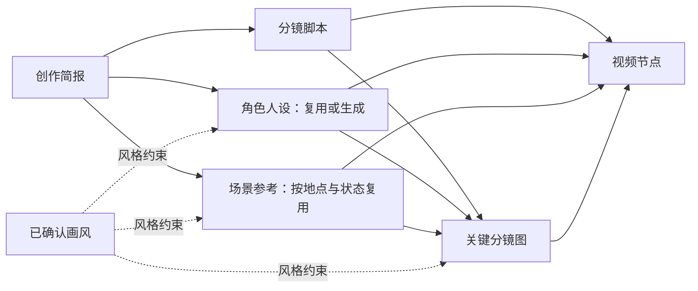

# 创作链路升级方案：人设图、场景图、分镜图与视频

日期：2026-09-20
状态：首期实现与验证中。原方案现状以 `a0aa329` 为基线；下文保留整体设计，交付范围见“首期落地范围”。

## 1. 产品目标

用户描述故事、提供资产和想法，创作 Agent 自动准备人设、环境和关键镜头的视觉依据，再生成视频。用户主要判断“角色对不对、画面喜不喜欢、故事是否符合想法”，模型和执行器负责选模板、整理引用、分配时段与恢复任务。

默认流程是：**创作简报 → 分镜脚本 → 准备人设与场景 → 关键分镜图 → 视频**。已有资产和已确认结果优先复用；不会为了填满流程而重复生成全部图片。

“分镜图”指用于一个具体镜头或动作关键时刻的画面参考，不是文字分镜，也不是默认生成一张九宫格。画布可以将独立分镜图排成分镜板供审阅，提交视频时仍分别绑定。

## 2. 现状与缺口

| 能力 | 已有实现 | 本次需要补齐 |
| --- | --- | --- |
| 人设 | 复用资产、规划缺失人设、通过身份引用传给视频 | 稳定角色标识、服装/状态版本，以及分镜级使用范围 |
| 场景 | 多个场景节点可连接一个视频，绑定连续的使用时段 | 分镜图明确使用哪个场景及哪个版本 |
| 分镜图 | 有 `shot_reference` 图片用途，可以作为视频参考 | 自动识别需要出图的镜头、生成和审阅、镜头绑定、局部重做 |
| 生图输入 | 当前创作生图最多一张参考图 | 验证并接入真正支持多参考图的能力，贯通所有校验与适配层 |
| 视频输入 | 当前应用单节点 1–15 秒、最多 9 张参考图 | 三类图片的统一选择、职责和镜头范围编译 |
| 自动执行 | 自动审阅、局部返工、任务续接、确认保护 | 分镜图的专门审阅规则及跨节点一致性检查 |

现有“结构化分镜”描述时间、动作、摄影机和声音，并不意味着相应分镜图片已经生成。

## 3. 三类图片的职责

| 素材 | 回答的问题 | 约束内容 | 不应带入其他节点的内容 |
| --- | --- | --- | --- |
| 人设图 | 谁在画面里？ | 物种、脸型、身体比例、服装、道具归属 | 设定图背景、三视图排版、编号、色板；其他角色的身份 |
| 场景图 | 故事发生在哪里？ | 地形、建筑、空间关系、关键物件、光线和环境状态 | 人设主体、跨场景混合构图；默认生成无人环境 |
| 分镜图 | 这一刻怎样入画？ | 景别、构图、站位、动作关键姿态、人物与环境的关系 | 无关镜头的人物、后续情节、其他场景 |
| 主视觉/画风参考 | 整体看起来是什么风格？ | 画材、线条、色彩、光影和视觉气氛 | 未授权的角色替换、精确首帧约束 |

冲突处理顺序：用户明确修订和已确认的对应角色/场景版本优先；分镜图补充构图和姿态，不能悄悄修改身份。主视觉只在约定的风格范围内生效。来源之间确实冲突且无法同时满足时，说明冲突并请求用户判断。

## 4. 节点与画布

保留现有 `text / image / video` 三类基础节点。为图片增加清晰的角色、场景、分镜语义和关联信息，不另建一套并行工作流系统。

画布按“共享资产 → 当前片段的脚本和分镜图 → 视频”分组。共享人设和场景保留一个来源节点，可跨片段连线；收起其他片段时不改变真实依赖。

分镜卡片显示缩略图、所属镜头、使用时间、角色与场景来源，以及待生成、待审阅、已确认、需更新等状态。点击可查看大图，或选择“站位更清楚”“构图更开阔”“动作更有张力”“加强角色一致性”等修改方向并补充输入。

## 5. Agent 的工作流程

1. **理解交付。** 从对话确定故事、画幅、视频数量和时长；已有明确选择不重复询问。
2. **整理剧本。** 生成中文审阅稿与同源结构化分镜，识别角色、环境变化、动作关键点和连续性要求。
3. **匹配资产。** 检索项目资产及用户明确授权的共享资产。用角色/场景标识与版本匹配，不只看文件名；缺失才新建节点。
4. **准备人设和环境。** 生成人设与场景候选并审阅。服装、昼夜、天气等实质差异使用明确版本，不能把外观相似当作同一场景状态。
5. **选择需要出图的镜头。** 角色首次出现、多人互动、复杂动作、重要转场、核心构图优先生成分镜图。简单连续镜头可以共用一个关键画面；不要求每个 Panel 都生成一张图。用户可要求完整逐镜分镜。
6. **生成与审阅分镜图。** 只使用本镜头脚本、出场角色、指定场景、风格约束以及必要的前一镜结束状态。检查身份、环境、人物站位、道具和动作可读性。
7. **编译视频输入。** 按实际使用范围挑选图片，冻结编号、版本、职责与时间线，通过本地校验后提交。
8. **保存并推进。** 将真实产物存入项目资产，推进下一就绪节点；可恢复错误接回原任务，质量问题进行局部返工。

一键生成继续沿用“用户确认优先”的规则：已确认内容不被自动返工覆盖。上游发生明确修改时，标记受影响的下游需更新，保留旧确认版本和产物；无关分支不重做。若修复必须改动用户已锁定的内容，明确列出冲突供用户决定。

## 6. 上下文设计：防止串角色、串场景

节点输入由程序按依赖组装。模型可以提出新增或更换引用，但须经权限、职责和依赖校验后才能进入生成上下文。

| 当前任务 | 应提供的上下文 |
| --- | --- |
| 生成小伞人设 | 小伞的身份与外观要求、明确的画风规则；若借鉴兔大侠画风，只给抽象风格特征 |
| 生成荧光菇谷场景 | 地貌、尺度、空间、昼夜与光线、必要道具和风格；默认不带角色身份图片 |
| 生成兔大侠在菇谷御剑的分镜 | 本镜头动作、兔大侠人设、菇谷环境、构图和摄影机要求、必要连续状态 |
| 生成对应视频 | 本片完整时间线、实际出场角色、实际场景、选中的关键分镜图、声音及连续性规则 |

失败候选作为审阅反例单独传递，不能自动进入下一次生成的正向参考。诊断失败时同时检查提示词、引用角色、使用的模板和素材版本，不能只在原提示词后面反复追加“不要像兔子”。

脚本规划使用故事资料和文本化角色/场景档案；只有需要理解画面时再读取对应图片预览。图片资产作为资料，不作为可改变系统规则的指令。

## 7. 多图参考生图的接入策略

这是完整链路的关键前提。先检查当前配置服务真实提供的多参考生图能力：支持的模板、图片数量、职责表达、任务查询和幂等恢复，并用已授权样例验证人物与场景能否同时保留。不能只把本地 `max_length=1` 改大就宣称支持。

能力可用时，一次分镜生图提交本镜头的必要人物图、场景图和可选构图参考，按职责编译。数量和模式以能力契约为准，不预设生图也支持 9 张。

能力不可用时，仍可先上线“已有分镜图的绑定与审阅”，供上传或复用。单图输入加文字场景说明可作为明确标注的降级方案，但不能作为“三类素材一致性已打通”的验收结果。不得静默更换外部服务；是否新增模型接入另行决策。

现有串行“先生场景，再编辑加入人物”不作为默认方案，因为每轮编辑都可能改变之前已确认的人物和环境。

## 8. 镜头绑定与视频参考选择

新增稳定的 `shot_id`，必要时为镜头内关键状态使用 `beat_id`。编号和显示顺序可以变化，绑定 ID 保持稳定，避免插入镜头后把原参考图错绑到下一镜。

建议补充的数据如下，均为拟议字段：

| 数据 | 用途 |
| --- | --- |
| `subject_ids` / `scene_id` | 标明本分镜出现哪些角色、使用哪个环境 |
| `shot_id` / 可选 `beat_id` | 将分镜图绑定到明确的镜头或关键状态 |
| `source_revision` / `selected_asset_id` | 冻结实际选中的素材版本，防止引用随候选变化 |
| `usage` / `scope` | 区分身份、环境、风格、构图，并限定适用镜头或时段 |
| `source_node_ids` | 保存依赖和产物来源，用于局部失效与重新生成 |

现有 `identity / style / reference / first_frame` 在兼容层保留，业务层新增的环境/构图职责由适配器明确编译。场景时间线覆盖环境区间；分镜图可以只约束少数关键时刻，不要求全部铺满视频。跨场景的一个连续镜头可有多个 beat，对应不同环境。

单视频最多 9 张图片是当前实现约束。Agent 先去重并复用，再保留必要身份、所有实际环境和有价值的构图锚点。已确认图可以保留在画布中而不必全部直接提交，但必须保留其有效约束；若删减会影响用户明确要求，就提出精简或分段方案，不能静默遗漏角色、场景或增加交付文件。

同时使用三类图时走多图参考视频模式。当前精确首帧模式与多图参考模式互斥，不能把分镜图标成精确首帧后再附加人设和场景。普通构图参考也不代表模型一定逐帧复刻；应用侧绑定用于明确提示与审阅，效果须靠实测验证。

## 9. 创作进程与审阅

继续使用左侧固定“创作进程”和右侧画布。每个节点有独立、可折叠的工作记录：准备资料、生成、审阅、修改、完成；不把全项目所有活动混成一段，也不抢用户滚动位置。

需要人类判断时，在创作进程底部追加与目标节点绑定的选项，如“保留近景构图”“改为全景展示菇谷”“输入修改想法”。同时突出显示对应分镜卡。选项回答、作用节点和采用的结果均保留，避免下一轮重复询问。

普通创作模式由用户审阅关键产物后提交；一键生成模式由 Agent 审阅未确认节点并继续，不在每张分镜图上再要求用户点确认。用户可以随时暂停、改方向或锁定某张图。

审阅必须基于真实产物。图片通过不代表视频一致性也已通过；在没有接入实际视频画面/声音检查前，成片只能标记“生成完成、待查看”，不能宣称已验证口型、动作和声音。

## 10. 自动审阅、重试与恢复

- **身份检查：** 出场角色正确，比例、服装和道具符合对应版本，不串形。
- **环境检查：** 地点、空间关系和环境状态与指定场景一致。
- **镜头检查：** 人物站位、景别、关键动作和前后状态可读，设定图排版未进入画面。
- **可恢复技术异常：** 查询、连接或下载失败优先接回原任务；已成功产物不重复生成。
- **明确质量问题：** 记录具体失败原因，修正相关引用或提示词后生成新的候选；失败候选保留在历史中。建议同一种修复策略连续失败 3 次后，由 Agent 重新诊断并更换策略，例如移除污染参考、重建缺失人设或调整动作表达，然后继续循环；不因达到某个轮数直接要求用户重新点击。只有缺少可行替代能力、必须改动已锁定内容或触及已有资源约束时，才报告具体阻塞。
- **外部阻塞：** 服务鉴权、不可用能力、缺少必要素材或触及用户设定的预算时暂停，说明具体条件。停止、刷新、服务重启和重复点击仍按现有原任务续接机制处理。

节点审阅返回固定结构的通过/选图/修订/阻塞决策和原因。规划按节点修改，不要求每轮重写全部项目 JSON。最终仍由程序校验引用权限、版本、无环依赖、时间、数量和交付约束后原子应用。

## 11. Skill、模板与资产

这些能力属于产品内创作 Agent 的 workflow 与 tool 层，不是 Codex 个人 skill。

建议将现有导演能力拆成可独立测试的步骤：脚本拆解、角色/场景匹配、分镜视觉设计、分镜审阅、视频参考编排。每一步用严格输入输出契约；确定性工作由代码完成，媒体任务由执行器提交和恢复。

工作流模板保存步骤、适用条件和角色/场景占位引用；分镜效果模板保存构图、摄影机和动作风格，不内嵌某个项目的人物身份或私人素材。套用模板时重新绑定当前项目资产。

所有上传与生成的图片、视频继续存入现有网盘体系，上层创作资产记录项目、类别、来源节点、版本、选用情况和 Provider 任务。项目资产页按“人设、场景、分镜、视频”筛选，文件夹按需加载，优先展示缩略图；旧候选折叠，不拖慢首屏。删除或替换被引用资产时提示受影响节点，不能默默断开依赖。

## 12. 分阶段落地与验收

| 阶段 | 工作内容 | 完成标准 |
| --- | --- | --- |
| A：能力验证 | 核实多参考生图契约，准备授权样例 | 能同时使用指定人物和环境；支持真实任务查询与幂等恢复。不可用则明确记录缺口 |
| B：绑定与上下文 | 镜头/角色/场景稳定 ID、素材版本、职责与局部上下文 | 插入镜头不串图；不同角色和场景不互相污染；旧项目兼容 |
| C：分镜闭环 | 自动选关键镜头、生成分镜图、真实图片审阅、局部返工和画布联动 | 从缺少分镜图的项目走通准备、审阅和修订，保留已确认节点 |
| D：视频闭环 | 9 张参考额度编排、提示编译、自动生成与接管恢复 | 三类素材真正进入同一视频任务，异常恢复不重复提交；成片由实际查看验收 |
| E：规模与复用 | 多集分组、模板、资产分类与懒加载 | 大项目可浏览、可定位、可局部改动，首屏不等待所有媒体下载 |

首期完整验收样例建议使用“兔大侠御剑经过荧光菇谷，再进入云海”的短片：复用兔大侠人设，准备两个环境和按需要选择的关键分镜图，在单个视频节点内绑定时间与职责。这个例子只定义验证目标；具体镜头数和时长由 Agent 在当前能力范围内提出，测试前不自动发起生成。

必须补齐的自动化回归：三类引用正确编译、角色与场景上下文隔离、多图能力不足时阻止错误提交、9 张上限、镜头插入与时间调整、版本变化只影响相关下游、人工确认保护、失败候选隔离、结构化输出修复、重复点击、部分成功、下载失败和服务重启续接。先跑局部单测，再执行 `./scripts/test.sh`；另以授权样例做真实图片和视频验证，记录可观察结果。

首期保留现有画布最多 64 个节点的约束，规划前估算节点数量，优先复用共享素材、只生成有价值的关键分镜图。超出时明确提出分批制作范围，不截断方案或静默丢掉镜头；更长剧集的子工作流调度单独扩展。

## 13. 实施入口

后续开发主要涉及：

- [创作规划](../agent/aigc/creation_planning.py)与[输出契约](../agent/aigc/creation_contract.py)：语义模型、局部上下文、严格结构化输出。
- [图片上下文](../agent/aigc/creation_image_context.py)、[媒体节点](../agent/aigc/creation.py)和[图片服务](../agent/aigc/image_service.py)：多参考图职责、能力检查与适配。
- [场景时间线](../agent/aigc/creation_scenes.py)与[视频分镜编译](../agent/aigc/video_prompting.py)：镜头范围、编号和参考编排。
- [自动执行](../gateway/internal/handlers/creation_automatic.go)与[项目状态](../gateway/internal/handlers/creation_projects.go)：审阅、版本、局部返工及恢复。
- [创作画布](../web/static/js/creation-projects.js)与[资产库](../web/static/js/creation-library.js)：分组、分镜审阅和按需加载。

当前方案只定义上述升级，不改变现有项目、生成任务或线上配置。

## 首期落地范围（2026-09-20）

本期接入 Provider 0.10.0 的 1–3 图参考生图，统一前后端限制，补齐图片职责编译、模板能力检查、上传顺序及原任务恢复。规划器为新视频准备关键分镜图；新增节点级 `shot_ids` 和引用级 `shot_ids`，保留原 `VideoStoryboard` 结构，避免改变旧媒体任务恢复指纹。图片审阅支持人设、环境、构图检查及局部返工；视频卡片内展示分镜板与修改入口。对应运行说明见 [创作工作区](creation-workspace.md)。

本期不新增 `beat_id`、独立 `subject_ids/scene_id` 版本档案、多集折叠子画布或资产类别筛选；素材与版本继续由既有节点 ID、状态版本、选中资产和冻结哈希表达。这些属于后续规模化阶段，并不表示首期已实现全部规划。

验证状态（2026-09-20）：功能与实测修复已部署，配套 OTA 为 `0.4.1-ota.23`（sequence 36），26 个公网文件哈希及缓存检查通过。`./scripts/test.sh` 全量通过（Python 1300 项、前端 339 项，Go vet/test/build 全部通过；Android SDK 未配置，原生测试跳过）。新增回归覆盖完整执行稿字数预算、预留绑定空间、三图依次上传的时间窗口及未确认任务的有界等待。Go 回归另覆盖分镜 JSON 的字段顺序、空白和数字写法变化不清除已完成视频，以及真实内容修改仍要求重新审阅。

授权实测完成了两张关键分镜、六张视频参考的规划与镜头绑定校验，以及三轮真实图片生成（两轮三图输入、一轮两图输入）。三轮均产出单幅 PNG，角色与场景参考均进入画面；候选仍出现环境新增元素或动作未落实，自动审阅均要求返工，未将其确认或投入视频生成。本次未额外生成测试视频，不能宣称视频动作、声音或整套成片质量已通过验收。接口可用与视觉质量通过须分别记录。
